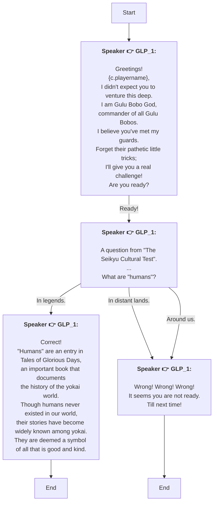

```mermaid
graph
Start -->1759525374602824[<b>Speaker 👉 GLP_1:</b>
\nGreetings!
&lbrace;c.playername&rbrace;,
I didn't expect you to venture this deep.\nI am Gulu Bobo God,
commander of all Gulu Bobos.
I believe you've met my guards.\nForget their pathetic little tricks;
I'll give you a real challenge!
Are you ready?]
1759525374602824 -->|Ready!|1759525703176780[<b>Speaker 👉 GLP_1:</b>
\nA question from &quot;The Seikyu Cultural Test&quot;.
...
What are &quot;humans&quot;?]
1759525703176780 -->|In legends.|1759526024569432[<b>Speaker 👉 GLP_1:</b>
\nCorrect!\n&quot;Humans&quot; are an entry in Tales of Glorious Days,
an important book that documents
the history of the yokai world.\nThough humans never existed in our world,
their stories have become widely known among yokai.
They are deemed a symbol of all that is good and kind.]
1759525703176780 -->|In distant lands.|1759525952616021[<b>Speaker 👉 GLP_1:</b>
\nWrong! Wrong! Wrong!\nIt seems you are not ready.
Till next time!]
1759525703176780 -->|Around us.|1759525952616021[<b>Speaker 👉 GLP_1:</b>
\nWrong! Wrong! Wrong!\nIt seems you are not ready.
Till next time!]
1759525952616021 -->1759526013052502[End]
1759526024569432 -->1759526016419415[End]

```