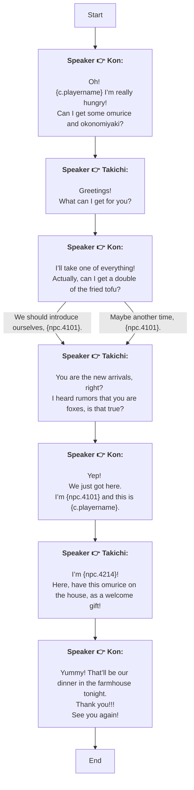

```mermaid
graph
Start -->1777941318007494[<b>Speaker 👉 Kon:</b>
\nOh! 
&lbrace;c.playername&rbrace; I’m really hungry!
Can I get some omurice and okonomiyaki?]
1777941318007494 -->1777941372076743[<b>Speaker 👉 Takichi:</b>
\nGreetings!
What can I get for you?]
1777941372076743 -->1777941397215945[<b>Speaker 👉 Kon:</b>
\nI’ll take one of everything!
Actually, can I get a double of the fried tofu?]
1777941397215945 -->|We should introduce ourselves, &lbrace;npc.4101&rbrace;.|1777941475492560[<b>Speaker 👉 Takichi:</b>
\nYou are the new arrivals, right? 
I heard rumors that you are foxes, is that true?]
1777941397215945 -->|Maybe another time, &lbrace;npc.4101&rbrace;.|1777941475492560[<b>Speaker 👉 Takichi:</b>
\nYou are the new arrivals, right? 
I heard rumors that you are foxes, is that true?]
1777941475492560 -->1777941539550931[<b>Speaker 👉 Kon:</b>
\nYep! 
We just got here.
I’m &lbrace;npc.4101&rbrace; and this is &lbrace;c.playername&rbrace;.]
1777941539550931 -->1777941768690390[<b>Speaker 👉 Takichi:</b>
\nI’m &lbrace;npc.4214&rbrace;!
Here, have this omurice on the house, as a welcome gift!]
1777941768690390 -->1777941777722073[<b>Speaker 👉 Kon:</b>
\nYummy! That’ll be our dinner in the farmhouse tonight.
Thank you!!!\nSee you again!]
1777941777722073 -->1741905938224452[End]

```