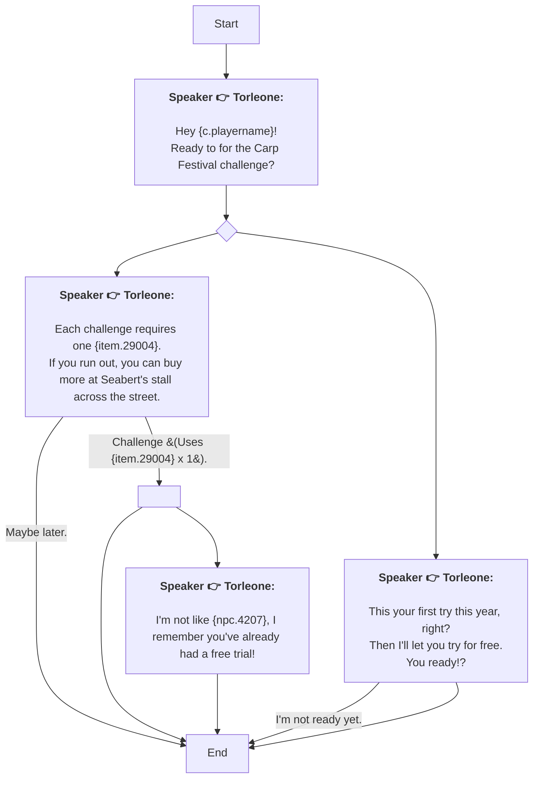

```mermaid
graph
Start -->1747827907015965[<b>Speaker 👉 Torleone:</b>
\nHey &lbrace;c.playername&rbrace;!
Ready to for the Carp Festival challenge?]
1747827907015965 -->1752005422132562{ }
1752005422132562 -->1752005655631188[<b>Speaker 👉 Torleone:</b>
\nEach challenge requires one &lbrace;item.29004&rbrace;.
If you run out, you can buy more at Seabert's stall across the street.]
1752005422132562 -->1752005877835099[<b>Speaker 👉 Torleone:</b>
\nThis your first try this year, right?
Then I'll let you try for free.
You ready!?]
1752005655631188 -->|Challenge &#40;Uses &lbrace;item.29004&rbrace; x 1&#41;.|1752005867783514[ ]
1752005655631188 -->|Maybe later.|1747827980024094[End]
1752005867783514 -->1752006146056546[<b>Speaker 👉 Torleone:</b>
\nI'm not like &lbrace;npc.4207&rbrace;, I remember you've already had a free trial!]
1752005867783514 -->1747827980024094[End]
1752006146056546 -->1747827980024094[End]
1752005877835099 -->|I'm not ready yet.|1747827980024094[End]
1752005877835099 -->1747827980024094[End]

```