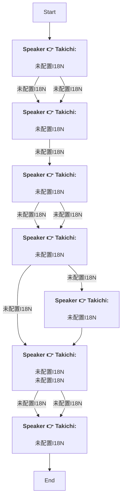

```mermaid
graph
Start -->1761452140830407[<b>Speaker 👉 Takichi:</b>
\n未配置I18N]
1761452140830407 -->|未配置I18N|1761452523136717[<b>Speaker 👉 Takichi:</b>
\n未配置I18N]
1761452140830407 -->|未配置I18N|1761452523136717[<b>Speaker 👉 Takichi:</b>
\n未配置I18N]
1761452523136717 -->|未配置I18N|1761452795966161[<b>Speaker 👉 Takichi:</b>
\n未配置I18N]
1761452795966161 -->|未配置I18N|1761453413620439[<b>Speaker 👉 Takichi:</b>
\n未配置I18N]
1761452795966161 -->|未配置I18N|1761453413620439[<b>Speaker 👉 Takichi:</b>
\n未配置I18N]
1761453413620439 -->|未配置I18N|1761456900277982[<b>Speaker 👉 Takichi:</b>
\n未配置I18N]
1761453413620439 -->|未配置I18N|1761456921394911[<b>Speaker 👉 Takichi:</b>
\n未配置I18N\n未配置I18N]
1761456921394911 -->|未配置I18N|1761457274348261[<b>Speaker 👉 Takichi:</b>
\n未配置I18N]
1761456921394911 -->|未配置I18N|1761457274348261[<b>Speaker 👉 Takichi:</b>
\n未配置I18N]
1761457274348261 -->1761457570014950[End]
1761456900277982 -->1761456921394911[<b>Speaker 👉 Takichi:</b>
\n未配置I18N\n未配置I18N]

```