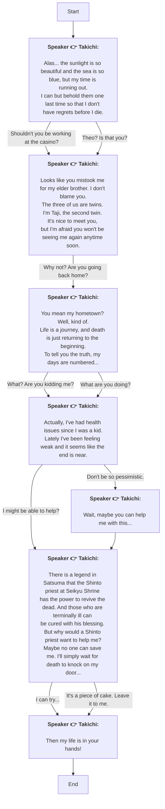

```mermaid
graph
Start -->1761452140830407[<b>Speaker 👉 Takichi:</b>
\nAlas... the sunlight is so beautiful and the sea is so blue, but my time is running out.
I can but behold them one last time so that I don't have regrets before I die.]
1761452140830407 -->|Shouldn't you be working at the casino?|1761452523136717[<b>Speaker 👉 Takichi:</b>
\nLooks like you mistook me for my elder brother. I don't blame you.
The three of us are twins. I'm Taji, the second twin. It's nice to meet you, 
but I'm afraid you won't be seeing me again anytime soon.]
1761452140830407 -->|Theo? Is that you?|1761452523136717[<b>Speaker 👉 Takichi:</b>
\nLooks like you mistook me for my elder brother. I don't blame you.
The three of us are twins. I'm Taji, the second twin. It's nice to meet you, 
but I'm afraid you won't be seeing me again anytime soon.]
1761452523136717 -->|Why not? Are you going back home?|1761452795966161[<b>Speaker 👉 Takichi:</b>
\nYou mean my hometown? Well, kind of.
Life is a journey, and death is just returning to the beginning.
To tell you the truth, my days are numbered...]
1761452795966161 -->|What? Are you kidding me?|1761453413620439[<b>Speaker 👉 Takichi:</b>
\nActually, I've had health issues since I was a kid.
Lately I've been feeling weak and it seems like the end is near.]
1761452795966161 -->|What are you doing?|1761453413620439[<b>Speaker 👉 Takichi:</b>
\nActually, I've had health issues since I was a kid.
Lately I've been feeling weak and it seems like the end is near.]
1761453413620439 -->|Don't be so pessimistic.|1761456900277982[<b>Speaker 👉 Takichi:</b>
\nWait, maybe you can help me with this...]
1761453413620439 -->|I might be able to help?|1761456921394911[<b>Speaker 👉 Takichi:</b>
\nThere is a legend in Satsuma that the Shinto priest at Seikyu Shrine 
has the power to revive the dead. And those who are terminally ill can 
be cured with his blessing. But why would a Shinto priest want to help me?\nMaybe no one can save me. I'll simply wait for death to knock on my door...]
1761456921394911 -->|I can try...|1761457274348261[<b>Speaker 👉 Takichi:</b>
\nThen my life is in your hands!]
1761456921394911 -->|It's a piece of cake. Leave it to me.|1761457274348261[<b>Speaker 👉 Takichi:</b>
\nThen my life is in your hands!]
1761457274348261 -->1761457570014950[End]
1761456900277982 -->1761456921394911[<b>Speaker 👉 Takichi:</b>
\nThere is a legend in Satsuma that the Shinto priest at Seikyu Shrine 
has the power to revive the dead. And those who are terminally ill can 
be cured with his blessing. But why would a Shinto priest want to help me?\nMaybe no one can save me. I'll simply wait for death to knock on my door...]

```