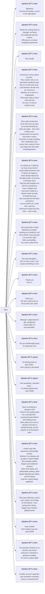

```mermaid
graph LR
Start -->1727301435705460[<b>Speaker 👉 Ama:</b>
\nWelcome!
If you're into fashion, you're in the right place!]
Start -->1727301435705462[<b>Speaker 👉 Ama:</b>
\nThanks for visiting! Here at Starlight, we blend
the traditional with the modern,
offering you a unique shopping experience!]
Start -->1727301450029176[<b>Speaker 👉 Ama:</b>
\nSee you…]
Start -->1727302348198010[<b>Speaker 👉 Ama:</b>
\nEveryone's curious about my past...
They wonder why an ex-idol would suddenly retire.
But it's not like that at all...\nI just wanted a life like this, so I went for it.
Whether as an idol or a shopkeeper,
I feel super lucky to have come this far!\nYou see, I'm just an ordinary soul.]
Start -->1727302348199038[<b>Speaker 👉 Ama:</b>
\nEven after all this time,
some fans from my days as an idol still drop by.\nMost are polite... But some of them can't 
accept what I've become, and make a scene.\nHonestly, it's quite troubling.
But I understand it all comes from a place of love.
I just hope time will make everything better.]
Start -->1727302348199040[<b>Speaker 👉 Ama:</b>
\nAs rushed as it might be,
we have some kind of social media presence now.\nIt makes me happy to share design ideas and
the daily routine of running a boutique store.\nYohji has also helped a lot with his connections.
Truly a reliable man.\nI was even invited to a fashion week recently.
I'd really like to go.\nBut I just opened the store and there's
a ton of stuff to do. Looks like I won't be
leaving the island any time soon... Such a pity.]
Start -->1727310682327220[<b>Speaker 👉 Ama:</b>
\nYou've got quite a body!
Would you consider working as a model for me?\nBe a shame if you just kept it to yourself, right?\nHaha, just kidding...
You seem a little tense.]
Start -->1727312747573430[<b>Speaker 👉 Ama:</b>
\nOh! How thoughtful...
But I'm not so sure I can accept something so nice.]
Start -->1727312747573432[<b>Speaker 👉 Ama:</b>
\nThank you!
I love it...]
Start -->1727312747573434[<b>Speaker 👉 Ama:</b>
\nThank you...
We don't need to be so formal with each other.]
Start -->1727312747574460[<b>Speaker 👉 Ama:</b>
\nAlthough I appreciate the gift, accepting it
would make me uncomfortable...]
Start -->1727312747574462[<b>Speaker 👉 Ama:</b>
\nAre you intentionally trying to embarrass me?]
Start -->1727312747574464[<b>Speaker 👉 player:</b>
\nI'm feeling closer to &lbrace;npc.4205&rbrace;...
We're going to get along!]
Start -->1727312747575490[<b>Speaker 👉 player:</b>
\nI did something I shouldn't have...
I'm feeling distant from &lbrace;npc.4205&rbrace;!]
Start -->1740294009384150[<b>Speaker 👉 Ama:</b>
\nHow's everything in &lbrace;location.13&rbrace;?
I think it's the perfect place for a secluded life... 
Leaving the past behind and starting anew.\nMost yokai who come to &lbrace;location.13&rbrace; have a
checkered past, but the majority of us find peace here.]
Start -->1740295246364888[<b>Speaker 👉 Ama:</b>
\nI heard Lady Inari possesses otherworldly beauty.
Wonder if my designs will be able to match that…\nShe probably prefers elegant and traditional kimonos
rather than trendy and fashionable clothing, right?\nMaybe blending the classic and the trendy
could be a good design approach.]
Start -->1753037631444768[<b>Speaker 👉 Ama:</b>
\nMiss &lbrace;npc.4209.last_name&rbrace; and I made a lot of flags
for the festival. I love seeing them flying...
Happy Carp Festival, &lbrace;playername&rbrace;!]
Start -->1753038002806561[<b>Speaker 👉 Ama:</b>
\nHave a blast!
Don't forget to go see &lbrace;npc.4206&rbrace;!]
Start -->1754913648385547[<b>Speaker 👉 Ama:</b>
\nThe Summer Festival is my favorite, you know?
Everyone is dressed in gorgeous yukatas.
It's such a unique sight!]
Start -->1754979887910413[<b>Speaker 👉 Ama:</b>
\nExactly, we can't squander such wonderful moments.
Have an amazing time!]

```