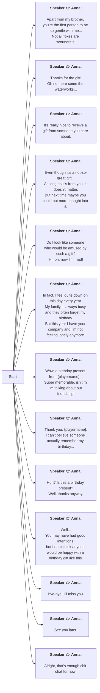

```mermaid
graph LR
Start -->1763317949160131[<b>Speaker 👉 Anna:</b>
\nApart from my brother, you're the first person to be so gentle with me...
Not all foxes are scoundrels!]
Start -->1763317949160133[<b>Speaker 👉 Anna:</b>
\nThanks for the gift!
Oh no, here come the waterworks...]
Start -->1763317949161159[<b>Speaker 👉 Anna:</b>
\nIt's really nice to receive a gift from someone you care about.]
Start -->1763317949161161[<b>Speaker 👉 Anna:</b>
\nEven though it's a not-so-great gift...
As long as it's from you, it doesn't matter.
But next time maybe you could put more thought into it.]
Start -->1763317949162187[<b>Speaker 👉 Anna:</b>
\nDo I look like someone who would be amused by such a gift?
Hmph, now I'm mad!]
Start -->1763317949162189[<b>Speaker 👉 Anna:</b>
\nIn fact, I feel quite down on this day every year.
My family is always busy and they often forget my birthday.
But this year I have your company and I'm not feeling lonely anymore.]
Start -->1763317949163215[<b>Speaker 👉 Anna:</b>
\nWow, a birthday present from &lbrace;playername&rbrace;...
Super memorable, isn't it?
I'm talking about our friendship!]
Start -->1763317949163217[<b>Speaker 👉 Anna:</b>
\nThank you, &lbrace;playername&rbrace;.
I can't believe someone actually remember my birthday...]
Start -->1763317949163219[<b>Speaker 👉 Anna:</b>
\nHuh? Is this a birthday present?
Well, thanks anyway.]
Start -->1763317949164245[<b>Speaker 👉 Anna:</b>
\nWell...
You may have had good intentions,
but I don't think anyone would be happy with a birthday gift like this.]
Start -->1763317949164247[<b>Speaker 👉 Anna:</b>
\nBye-bye! I'll miss you.]
Start -->1763317949164249[<b>Speaker 👉 Anna:</b>
\nSee you later!]
Start -->1763317949165275[<b>Speaker 👉 Anna:</b>
\nAlright, that's enough chit-chat for now!]

```