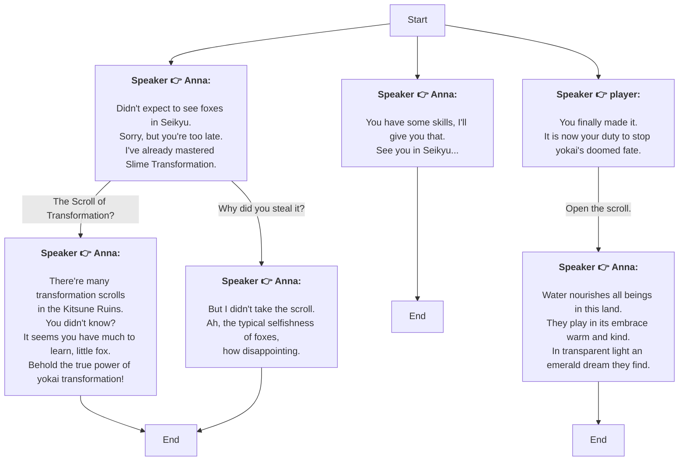

```mermaid
graph
Start -->1761904066451096[<b>Speaker 👉 Anna:</b>
\nDidn't expect to see foxes in Seikyu.
Sorry, but you're too late.
I've already mastered Slime Transformation.]
1761904066451096 -->|The Scroll of Transformation?|1761904219436703[<b>Speaker 👉 Anna:</b>
\nThere're many transformation scrolls
in the Kitsune Ruins.
You didn't know?\nIt seems you have much to learn, little fox.
Behold the true power of yokai transformation!]
1761904066451096 -->|Why did you steal it?|1761904217338526[<b>Speaker 👉 Anna:</b>
\nBut I didn't take the scroll.
Ah, the typical selfishness of foxes,
how disappointing.]
1761904219436703 -->1761904296355488[End]
1761904217338526 -->1761904296355488[End]
Start -->1761904323485346[<b>Speaker 👉 Anna:</b>
\nYou have some skills, I'll give you that.
See you in Seikyu...]
1761904323485346 -->1761904334855843[End]
Start -->1761904364511909[<b>Speaker 👉 player:</b>
\nYou finally made it.
It is now your duty to stop yokai's doomed fate.]
1761904364511909 -->|Open the scroll.|1761904609494703[<b>Speaker 👉 Anna:</b>
\nWater nourishes all beings in this land.
They play in its embrace warm and kind.
In transparent light an emerald dream they find.]
1761904609494703 -->1761905058233008[End]

```