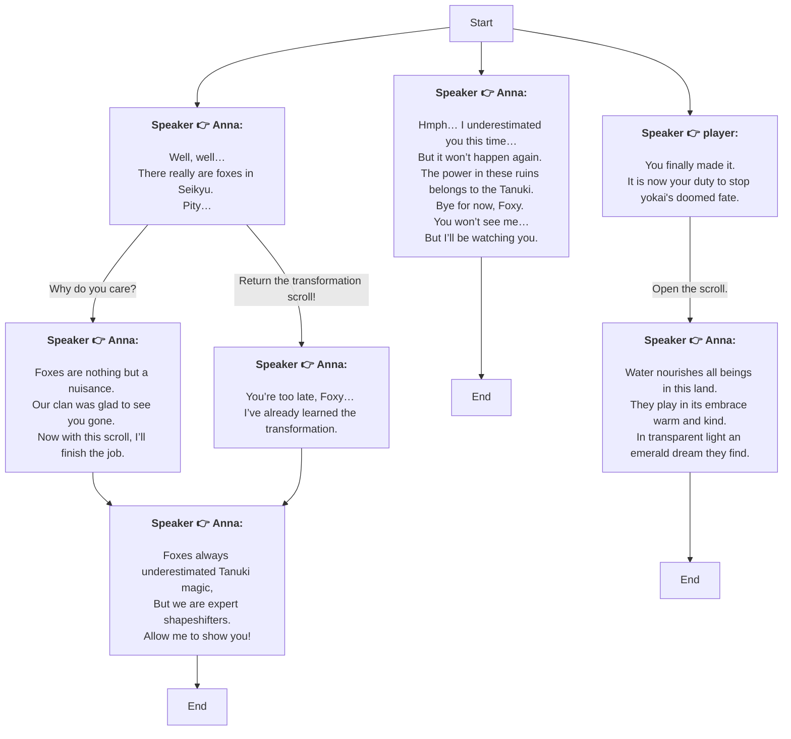

```mermaid
graph
Start -->1761904066451096[<b>Speaker 👉 Anna:</b>
\nWell, well…
There really are foxes in Seikyu. 
Pity…]
1761904066451096 -->|Return the transformation scroll!|1761904217338526[<b>Speaker 👉 Anna:</b>
\nYou’re too late, Foxy… 
I’ve already learned the transformation.]
1761904066451096 -->|Why do you care?|1761904219436703[<b>Speaker 👉 Anna:</b>
\nFoxes are nothing but a nuisance. 
Our clan was glad to see you gone. 
Now with this scroll, I’ll finish the job.]
1761904219436703 -->1777657938748102[<b>Speaker 👉 Anna:</b>
\nFoxes always underestimated Tanuki magic,
But we are expert shapeshifters.\nAllow me to show you!]
1777657938748102 -->1761904296355488[End]
1761904217338526 -->1777657938748102[<b>Speaker 👉 Anna:</b>
\nFoxes always underestimated Tanuki magic,
But we are expert shapeshifters.\nAllow me to show you!]
Start -->1761904323485346[<b>Speaker 👉 Anna:</b>
\nHmph… I underestimated you this time…
But it won’t happen again. 
The power in these ruins belongs to the Tanuki.\nBye for now, Foxy. 
You won’t see me…
But I’ll be watching you.]
1761904323485346 -->1761904334855843[End]
Start -->1761904364511909[<b>Speaker 👉 player:</b>
\nYou finally made it.
It is now your duty to stop yokai's doomed fate.]
1761904364511909 -->|Open the scroll.|1761904609494703[<b>Speaker 👉 Anna:</b>
\nWater nourishes all beings in this land.
They play in its embrace warm and kind.
In transparent light an emerald dream they find.]
1761904609494703 -->1761905058233008[End]

```