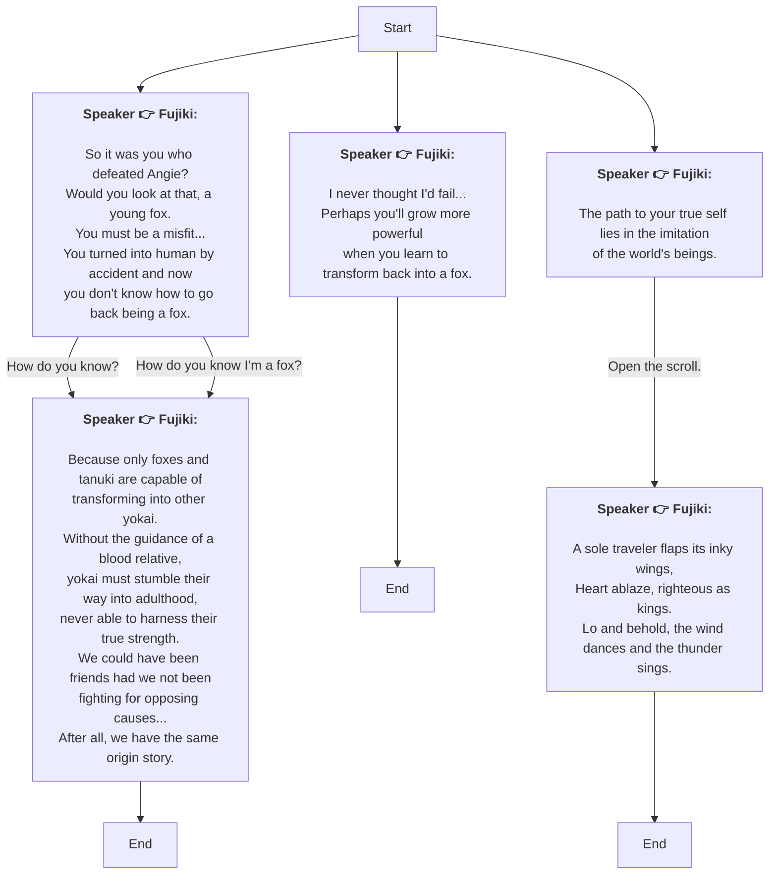

```mermaid
graph
Start -->1761912478631195[<b>Speaker 👉 Fujiki:</b>
\nSo it was you who defeated Angie?
Would you look at that, a young fox.\nYou must be a misfit...
You turned into human by accident and now
you don't know how to go back being a fox.]
1761912478631195 -->|How do you know?|1761912638464290[<b>Speaker 👉 Fujiki:</b>
\nBecause only foxes and tanuki are capable of
transforming into other yokai.\nWithout the guidance of a blood relative,
yokai must stumble their way into adulthood,
never able to harness their true strength.\nWe could have been friends had we not been
fighting for opposing causes...
After all, we have the same origin story.]
1761912478631195 -->|How do you know I'm a fox?|1761912638464290[<b>Speaker 👉 Fujiki:</b>
\nBecause only foxes and tanuki are capable of
transforming into other yokai.\nWithout the guidance of a blood relative,
yokai must stumble their way into adulthood,
never able to harness their true strength.\nWe could have been friends had we not been
fighting for opposing causes...
After all, we have the same origin story.]
1761912638464290 -->1761912658734371[End]
Start -->1761912698906916[<b>Speaker 👉 Fujiki:</b>
\nI never thought I'd fail...\nPerhaps you'll grow more powerful
when you learn to transform back into a fox.]
1761912698906916 -->1761912704325925[End]
Start -->1761912114398485[<b>Speaker 👉 Fujiki:</b>
\nThe path to your true self lies in the imitation
of the world's beings.]
1761912114398485 -->|Open the scroll.|1761912374859033[<b>Speaker 👉 Fujiki:</b>
\nA sole traveler flaps its inky wings,
Heart ablaze, righteous as kings.
Lo and behold, the wind dances and the thunder sings.]
1761912374859033 -->1761912379004186[End]

```