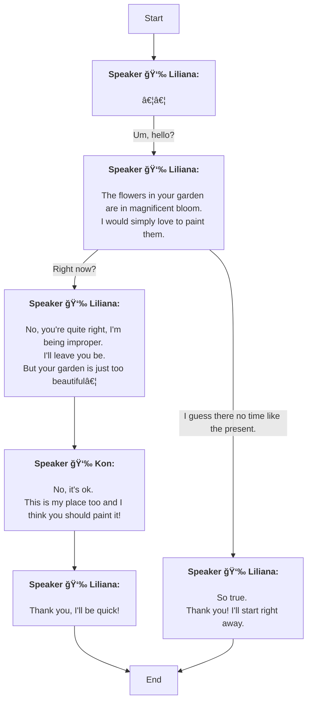

```mermaid
graph
Start -->1771104039739884[<b>Speaker 👉 Liliana:</b>
\n……]
1771104039739884 -->|Um, hello?|1771104039741935[<b>Speaker 👉 Liliana:</b>
\nThe flowers in your garden are in magnificent bloom.\nI would simply love to paint them.]
1771104039741935 -->|Right now?|1771104039743987[<b>Speaker 👉 Liliana:</b>
\nNo, you're quite right, I'm being improper. 
I'll leave you be.\nBut your garden is just too beautiful…]
1771104039741935 -->|I guess there no time like the present.|1771104039749112[<b>Speaker 👉 Liliana:</b>
\nSo true. 
Thank you! I'll start right away.]
1771104039743987 -->1771104039746036[<b>Speaker 👉 Kon:</b>
\nNo, it's ok. 
This is my place too and I think you should paint it!]
1771104039746036 -->1771104039747061[<b>Speaker 👉 Liliana:</b>
\nThank you, I'll be quick!]
1771104039747061 -->1771104039747062[End]
1771104039749112 -->1771104039747062[End]

```