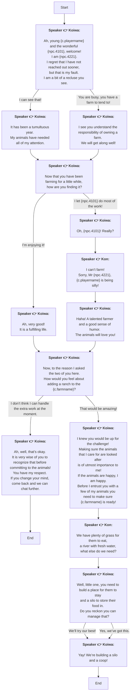

```mermaid
graph
Start -->1775610780080644[<b>Speaker 👉 Koiwa:</b>
\nAh, young &lbrace;c.playername&rbrace; and the wonderful &lbrace;npc.4101&rbrace;, welcome!
I am &lbrace;npc.4221&rbrace;.\nI regret that I have not reached out sooner, 
but that is my fault. 
I am a bit of a recluse you see.]
1775610780080644 -->|You are busy, you have a farm to tend to!|1775610833639956[<b>Speaker 👉 Koiwa:</b>
\nI see you understand the responsibility of owning a farm. 
We will get along well!]
1775610780080644 -->|I can see that!|1775610817923600[<b>Speaker 👉 Koiwa:</b>
\nIt has been a tumultuous year. 
My animals have needed all of my attention.]
1775610817923600 -->1775610846411287[<b>Speaker 👉 Koiwa:</b>
\nNow that you have been farming for a little while, 
how are you finding it?]
1775610846411287 -->|I let &lbrace;npc.4101&rbrace; do most of the work!|1775610892583460[<b>Speaker 👉 Koiwa:</b>
\nOh, &lbrace;npc.4101&rbrace;! Really?]
1775610846411287 -->|I’m enjoying it!|1775610884123169[<b>Speaker 👉 Koiwa:</b>
\nAh, very good! 
It is a fulfilling life.]
1775610884123169 -->1775610943101485[<b>Speaker 👉 Koiwa:</b>
\nNow, to the reason I asked the two of you here.
How would you feel about adding a ranch to the &lbrace;c.farmname&rbrace;?]
1775610943101485 -->|That would be amazing!|1775611038574141[<b>Speaker 👉 Koiwa:</b>
\nI knew you would be up for the challenge! 
Making sure the animals that I care for are looked after 
is of utmost importance to me!\nIf the animals are happy, I am happy.\nBefore I entrust you with a few of my animals you need to make sure &lbrace;c.farmname&rbrace; is ready!]
1775610943101485 -->|I don’t think I can handle the extra work at the moment.|1775611001874999[<b>Speaker 👉 Koiwa:</b>
\nAh, well, that’s okay. 
It is very wise of you to recognize that before committing to the animals!\nYou have my respect. 
If you change your mind, come back and we can chat further.]
1775611001874999 -->1775611032971836[End]
1775611038574141 -->1775611067504194[<b>Speaker 👉 Kon:</b>
\nWe have plenty of grass for them to eat, 
a river with fresh water, 
what else do we need?]
1775611067504194 -->1775611104169543[<b>Speaker 👉 Koiwa:</b>
\nWell, little one, you need to build a place for them to stay 
and a silo to store their food in. 
Do you reckon you can manage that?]
1775611104169543 -->|We’ll try our best!|1775611138574929[<b>Speaker 👉 Koiwa:</b>
\nYay! We’re building a silo and a coop!]
1775611104169543 -->|Yes, we’ve got this.|1775611138574929[<b>Speaker 👉 Koiwa:</b>
\nYay! We’re building a silo and a coop!]
1775611138574929 -->1775611089273414[End]
1775610892583460 -->1775610901299751[<b>Speaker 👉 Kon:</b>
\nI can’t farm!
Sorry, Mr &lbrace;npc.4221&rbrace;, &lbrace;c.playername&rbrace; is being silly!]
1775610901299751 -->1775610920705578[<b>Speaker 👉 Koiwa:</b>
\nHaha! A talented farmer and a good sense of humor. 
The animals will love you!]
1775610920705578 -->1775610943101485[<b>Speaker 👉 Koiwa:</b>
\nNow, to the reason I asked the two of you here.
How would you feel about adding a ranch to the &lbrace;c.farmname&rbrace;?]
1775610833639956 -->1775610846411287[<b>Speaker 👉 Koiwa:</b>
\nNow that you have been farming for a little while, 
how are you finding it?]

```