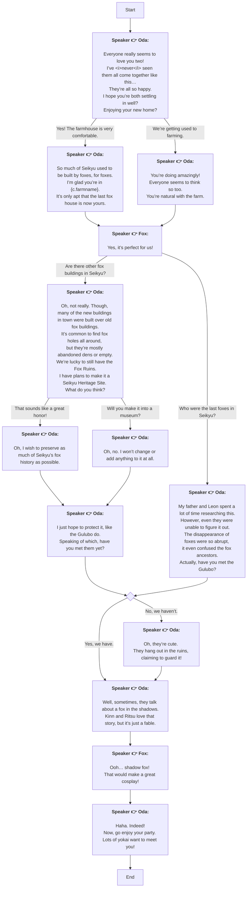

```mermaid
graph
Start -->1776770149381666[<b>Speaker 👉 Oda:</b>
\nEveryone really seems to love you two!
I’ve &lt;i&gt;never&lt;/i&gt; seen them all come together like this…
They’re all so happy.\nI hope you’re both settling in well?
Enjoying your new home?]
1776770149381666 -->|Yes! The farmhouse is very comfortable.|1776770230823473[<b>Speaker 👉 Oda:</b>
\nSo much of Seikyu used to be built by foxes, for foxes.
I’m glad you’re in &lbrace;c.farmname&rbrace;.
It’s only apt that the last fox house is now yours.]
1776770149381666 -->|We’re getting used to farming.|1776770323120695[<b>Speaker 👉 Oda:</b>
\nYou’re doing amazingly!
Everyone seems to think so too.
You’re natural with the farm.]
1776770230823473 -->1776770343655994[<b>Speaker 👉 Fox:</b>
\nYes, it’s perfect for us!]
1776770343655994 -->|Are there other fox buildings in Seikyu?|1776770401877572[<b>Speaker 👉 Oda:</b>
\nOh, not really. Though, 
many of the new buildings in town were built over old fox buildings.\nIt’s common to find fox holes all around, 
but they’re mostly abandoned dens or empty.\nWe’re lucky to still have the Fox Ruins.
I have plans to make it a Seikyu Heritage Site. 
What do you think?]
1776770343655994 -->|Who were the last foxes in Seikyu?|1776770598686299[<b>Speaker 👉 Oda:</b>
\nMy father and Leon spent a lot of time researching this.
However, even they were unable to figure it out.\nThe disappearance of foxes were so abrupt, 
it even confused the fox ancestors.\nActually, have you met the Gulubo?]
1776770401877572 -->|That sounds like a great honor!|1776770477535824[<b>Speaker 👉 Oda:</b>
\nOh, I wish to preserve as much of Seikyu’s fox history as possible.]
1776770401877572 -->|Will you make it into a museum?|1776770537843285[<b>Speaker 👉 Oda:</b>
\nOh, no. I won’t change or add anything to it at all.]
1776770477535824 -->1776770555731544[<b>Speaker 👉 Oda:</b>
\nI just hope to protect it, like the Gulubo do.
Speaking of which, have you met them yet?]
1776770555731544 -->444192638932886{ }
1776770721026664 -->1776770764008046[<b>Speaker 👉 Fox:</b>
\nOoh… shadow fox! 
That would make a great cosplay!]
1776770764008046 -->1776770876032625[<b>Speaker 👉 Oda:</b>
\nHaha. Indeed!
Now, go enjoy your party. 
Lots of yokai want to meet you!]
1776770876032625 -->1776770151461411[End]
444192638932886 -->|Yes, we have.|1776770721026664[<b>Speaker 👉 Oda:</b>
\nWell, sometimes, they talk about a fox in the shadows.
Kinn and Ritsu love that story, but it’s just a fable.]
444192638932886 -->|No, we haven’t.|1776770728093291[<b>Speaker 👉 Oda:</b>
\nOh, they’re cute. 
They hang out in the ruins, claiming to guard it!]
1776770728093291 -->1776770721026664[<b>Speaker 👉 Oda:</b>
\nWell, sometimes, they talk about a fox in the shadows.
Kinn and Ritsu love that story, but it’s just a fable.]
1776770537843285 -->1776770555731544[<b>Speaker 👉 Oda:</b>
\nI just hope to protect it, like the Gulubo do.
Speaking of which, have you met them yet?]
1776770598686299 -->444192638932886{ }
1776770323120695 -->1776770343655994[<b>Speaker 👉 Fox:</b>
\nYes, it’s perfect for us!]

```