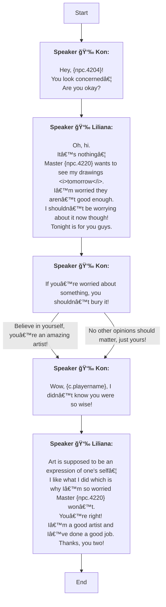

```mermaid
graph
Start -->1776775894574912[<b>Speaker 👉 Kon:</b>
\nHey, &lbrace;npc.4204&rbrace;!
You look concerned…
Are you okay?]
1776775894574912 -->1776775910072130[<b>Speaker 👉 Liliana:</b>
\nOh, hi.
It’s nothing…\nMaster &lbrace;npc.4220&rbrace; wants to see my drawings &lt;i&gt;tomorrow&lt;/i&gt;.
I’m worried they aren’t good enough.\nI shouldn’t be worrying about it now though!
Tonight is for you guys.]
1776775910072130 -->1776776013136711[<b>Speaker 👉 Kon:</b>
\nIf you’re worried about something, you shouldn’t bury it!]
1776776013136711 -->|Believe in yourself, you’re an amazing artist!|1776776091809620[<b>Speaker 👉 Kon:</b>
\nWow, &lbrace;c.playername&rbrace;, I didn’t know you were so wise!]
1776776013136711 -->|No other opinions should matter, just yours!|1776776091809620[<b>Speaker 👉 Kon:</b>
\nWow, &lbrace;c.playername&rbrace;, I didn’t know you were so wise!]
1776776091809620 -->1776776142808921[<b>Speaker 👉 Liliana:</b>
\nArt is supposed to be an expression of one's self…
I like what I did which is why I’m so worried Master &lbrace;npc.4220&rbrace; won’t.\nYou’re right! 
I’m a good artist and I’ve done a good job. 
Thanks, you two!]
1776776142808921 -->1776775892376383[End]

```