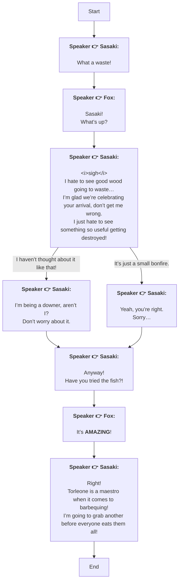

```mermaid
graph
Start -->1776778577521620[<b>Speaker 👉 Sasaki:</b>
\nWhat a waste!]
1776778577521620 -->1776778588862422[<b>Speaker 👉 Fox:</b>
\nSasaki! 
What’s up?]
1776778588862422 -->1776778603026392[<b>Speaker 👉 Sasaki:</b>
\n&lt;i&gt;sigh&lt;/i&gt;
I hate to see good wood going to waste…\nI’m glad we’re celebrating your arrival, don’t get me wrong.
I just hate to see something so useful getting destroyed!]
1776778603026392 -->|It’s just a small bonfire.|1776778695986149[<b>Speaker 👉 Sasaki:</b>
\nYeah, you’re right. 
Sorry…]
1776778603026392 -->|I haven’t thought about it like that!|1776778646201315[<b>Speaker 👉 Sasaki:</b>
\nI’m being a downer, aren’t I?
Don’t worry about it.]
1776778646201315 -->1776778713370600[<b>Speaker 👉 Sasaki:</b>
\nAnyway!
Have you tried the fish?!]
1776778713370600 -->1776778780464107[<b>Speaker 👉 Fox:</b>
\nIt’s <b>AMAZING</b>!]
1776778780464107 -->1776778792775661[<b>Speaker 👉 Sasaki:</b>
\nRight!
Torleone is a maestro when it comes to barbequing!\nI’m going to grab another before everyone eats them all!]
1776778792775661 -->1776778873411570[End]
1776778695986149 -->1776778713370600[<b>Speaker 👉 Sasaki:</b>
\nAnyway!
Have you tried the fish?!]

```