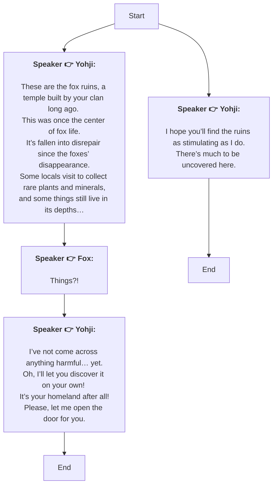

```mermaid
graph
Start -->1776933277376040[<b>Speaker 👉 Yohji:</b>
\nThese are the fox ruins, a temple built by your clan long ago. 
This was once the center of fox life.
It’s fallen into disrepair since the foxes’ disappearance.\nSome locals visit to collect rare plants and minerals,
and some things still live in its depths…]
1776933277376040 -->1776933410887209[<b>Speaker 👉 Fox:</b>
\nThings?!]
1776933410887209 -->1776933430477354[<b>Speaker 👉 Yohji:</b>
\nI’ve not come across anything harmful… yet.
Oh, I’ll let you discover it on your own! 
It’s your homeland after all!\nPlease, let me open the door for you.]
1776933430477354 -->1776933455632941[End]
Start -->1776933701587507[<b>Speaker 👉 Yohji:</b>
\nI hope you’ll find the ruins as stimulating as I do.
There’s much to be uncovered here.]
1776933701587507 -->1776933889576502[End]

```