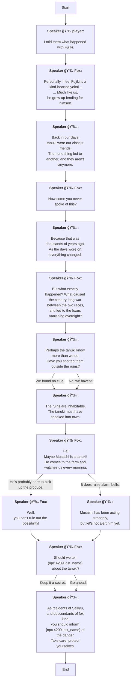

```mermaid
graph
Start -->1761914154096955[<b>Speaker 👉 player:</b>
\nI told them what happened with Fujiki.]
1761914154096955 -->1761914208560445[<b>Speaker 👉 Fox:</b>
\nPersonally, I feel Fujiki is a kind-hearted yokai...
... Much like us,
he grew up fending for himself.]
1761914208560445 -->1761914176858428[<b>Speaker 👉 :</b>
\nBack in our days,
tanuki were our closest friends.
Then one thing led to another, and they aren't anymore.]
1761914176858428 -->1761914238160190[<b>Speaker 👉 Fox:</b>
\nHow come you never spoke of this?]
1761914238160190 -->1761914250049855[<b>Speaker 👉 :</b>
\nBecause that was thousands of years ago.
As the days wore on,
everything changed.]
1761914250049855 -->1761914266264896[<b>Speaker 👉 Fox:</b>
\nBut what exactly happened? What caused 
the century-long war between the two races,
and led to the foxes vanishing overnight?]
1761914266264896 -->1761914284779841[<b>Speaker 👉 :</b>
\nPerhaps the tanuki know more than we do.
Have you spotted them outside the ruins?]
1761914284779841 -->|We found no clue.|1761914321836360[<b>Speaker 👉 :</b>
\nThe ruins are inhabitable.
The tanuki must have sneaked into town.]
1761914284779841 -->|No, we haven't.|1761914321836360[<b>Speaker 👉 :</b>
\nThe ruins are inhabitable.
The tanuki must have sneaked into town.]
1761914321836360 -->1761914336786761[<b>Speaker 👉 Fox:</b>
\nHa!
Maybe Musashi is a tanuki!
He comes to the farm and watches us every morning.]
1761914336786761 -->|It does raise alarm bells.|1761914443819346[<b>Speaker 👉 :</b>
\nMusashi has been acting strangely,
but let's not alert him yet.]
1761914336786761 -->|He's probably here to pick up the produce.|1761914365450575[<b>Speaker 👉 Fox:</b>
\nWell,
you can't rule out the possibility!]
1761914365450575 -->1761914371688784[<b>Speaker 👉 Fox:</b>
\nShould we tell &lbrace;npc.4209.last_name&rbrace; about the tanuki?]
1761914371688784 -->|Keep it a secret.|1761914485231961[<b>Speaker 👉 :</b>
\nAs residents of Seikyu,
and descendants of fox kind,
you should inform &lbrace;npc.4209.last_name&rbrace; of the danger.\nTake care, protect yourselves.]
1761914371688784 -->|Go ahead.|1761914485231961[<b>Speaker 👉 :</b>
\nAs residents of Seikyu,
and descendants of fox kind,
you should inform &lbrace;npc.4209.last_name&rbrace; of the danger.\nTake care, protect yourselves.]
1761914485231961 -->1761914621797722[End]
1761914443819346 -->1761914371688784[<b>Speaker 👉 Fox:</b>
\nShould we tell &lbrace;npc.4209.last_name&rbrace; about the tanuki?]

```