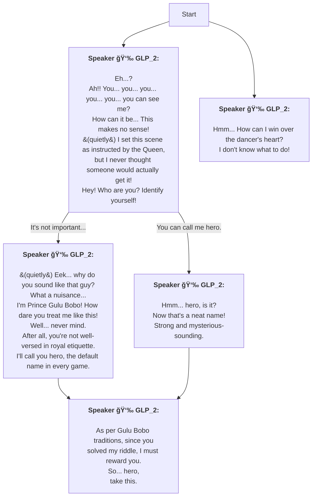

```mermaid
graph
Start -->1719149895073827[<b>Speaker 👉 GLP_2:</b>
\nEh...?
Ah!! You... you... you... you... you... you can see me?\nHow can it be... This makes no sense!
&#40;quietly&#41; I set this scene as instructed by the Queen,
but I never thought someone would actually get it!\nHey! Who are you? Identify yourself!]
1719149895073827 -->|You can call me hero.|1719152199926806[<b>Speaker 👉 GLP_2:</b>
\nHmm... hero, is it?
Now that's a neat name!
Strong and mysterious-sounding.]
1719149895073827 -->|It's not important...|1719149977353257[<b>Speaker 👉 GLP_2:</b>
\n&#40;quietly&#41; Eek... why do you sound like that guy?
What a nuisance...
I'm Prince Gulu Bobo! How dare you treat me like this!\nWell... never mind.
After all, you're not well-versed in royal etiquette.
I'll call you hero, the default name in every game.]
1719149977353257 -->1719153501420566[<b>Speaker 👉 GLP_2:</b>
\nAs per Gulu Bobo traditions, since you
solved my riddle, I must reward you.\nSo... hero,
take this.]
1719152199926806 -->1719153501420566[<b>Speaker 👉 GLP_2:</b>
\nAs per Gulu Bobo traditions, since you
solved my riddle, I must reward you.\nSo... hero,
take this.]
Start -->1724022901524527[<b>Speaker 👉 GLP_2:</b>
\nHmm... How can I win over the dancer's heart?
I don't know what to do!]

```