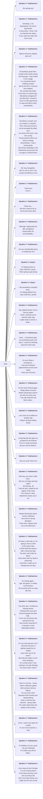

```mermaid
graph LR
Start -->1727669208028345[<b>Speaker 👉 Hephaestus:</b>
\nBe seeing you!]
Start -->1727669228803259[<b>Speaker 👉 Hephaestus:</b>
\nGreetings, I am Hephaestus, the town's blacksmith.
A long name, I know. Call me Hefi like the others.
If you need any help, feel free to ask.]
Start -->1727669228804285[<b>Speaker 👉 Hephaestus:</b>
\nWant to lift some weights with me?]
Start -->1727669265736895[<b>Speaker 👉 Hephaestus:</b>
\nEverything's great here, except news travels slowly.
Not long ago, I was invited to be a judge 
in a renowned sword smithing contest.\nBut by the time I received the invitation,
the contest had ended more than six months ago...\nAbsolutely outrageous!!!
Just like that, I missed a once-in-a-life opportunity
to meet and talk to other swordsmiths.]
Start -->1727669265736897[<b>Speaker 👉 Hephaestus:</b>
\nMy father's a dwarf, and my mother's a vampire...
Their child was bound to not be accepted by either race.\nI've known this since I was very young.
Preconceived notions are hard to change.\nNevertheless, I had a loving family.
We all face hardships in life.
Oftentimes we just lack the courage to confront them.]
Start -->1727669712214211[<b>Speaker 👉 Hephaestus:</b>
\nOh! How thoughtful...
But I'm not so sure I can accept something so nice.]
Start -->1727669712214213[<b>Speaker 👉 Hephaestus:</b>
\nThank you!
I love it...]
Start -->1727669712214215[<b>Speaker 👉 Hephaestus:</b>
\nThank you...
We don't need to be so formal with each other.]
Start -->1727669712214217[<b>Speaker 👉 Hephaestus:</b>
\nAlthough I appreciate the gift, accepting it
would make me uncomfortable...]
Start -->1727669712215243[<b>Speaker 👉 Hephaestus:</b>
\nAre you intentionally trying to embarrass me?]
Start -->1727669712215245[<b>Speaker 👉 player:</b>
\nI'm feeling closer to &lbrace;npc.4106.first_name&rbrace;...
We're going to get along!]
Start -->1727669712215247[<b>Speaker 👉 player:</b>
\nI did something I shouldn't have...
I'm feeling distant from &lbrace;npc.4106.first_name&rbrace;!]
Start -->1750913663781145[<b>Speaker 👉 Hephaestus:</b>
\nHey, &lbrace;playername&rbrace;, nice to see you again.
I think I worked out too hard the other day.
I might need to rest for a while...]
Start -->1751446334634282[<b>Speaker 👉 Hephaestus:</b>
\nHmm... it should be right, but something seems off.
Sorry, I zoned out thinking about the steel ratio.]
Start -->1751446658345260[<b>Speaker 👉 Hephaestus:</b>
\nIt's you! What a coincidence...
I was just thinking if &lbrace;playername&rbrace; would come today.
That's just uncanny!]
Start -->1753041040684836[<b>Speaker 👉 Hephaestus:</b>
\nIt's the Carp Festival again. Really takes me back!
Master Muramasa used to go with me every year.
I can still smell the red bean cakes...]
Start -->1753042058365733[<b>Speaker 👉 Hephaestus:</b>
\nLet's save our troubles for another day.
Today's all about letting loose!]
Start -->1754981984533008[<b>Speaker 👉 Hephaestus:</b>
\nA dog day like this gets me pumped for the festival!
Put on a mask and leave all your worries behind...]
Start -->1754982933656081[<b>Speaker 👉 Hephaestus:</b>
\nSee you soon! Have fun!]
Start -->1756859381660193[<b>Speaker 👉 Hephaestus:</b>
\nMorning, you seem a little tired...
Did you not sleep well last night?
&#40;Yawning...&#41;\nTruth be told, I pulled an all-nighter at the shop.
The moment I relax, sleepiness creeps up on me.]
Start -->1756860676656676[<b>Speaker 👉 Hephaestus:</b>
\nMaster Muramasa said a worthy craftsman
must have a strong physique.
That's why I always work out in the afternoon!]
Start -->1756926446448167[<b>Speaker 👉 Hephaestus:</b>
\nIt's been a slow day, so I'm going to have a drink
at the tavern later.
A drink feels like heaven after a long hard day.\nToo bad I can't hold my liquor;
three shots and my head is swimming.
And when I wake up it's already the next day.]
Start -->1756928046077482[<b>Speaker 👉 Hephaestus:</b>
\nIt's raining again...
Ugh, this gloom, it makes me feel down.
All my joints ache on a day like this.]
Start -->1756928373282348[<b>Speaker 👉 Hephaestus:</b>
\nThe other day, I smelled an alluring aroma.
I followed the scent and almost bumped into Miss Oda...\nTurns out, the aroma was coming from her.
How should I describe it?
It was like a most delectable dessert.]
Start -->1757728986413649[<b>Speaker 👉 Hephaestus:</b>
\nI'm not a kid anymore, but I still have this fear of
getting caught by my master
every time I go to the tavern.\nBut that just makes it even more tempting...
At a certain point, it has nothing to do with drinking.
You know what I mean?]
Start -->1758010727046748[<b>Speaker 👉 Hephaestus:</b>
\nHere's a fun fact... Areas where craftsmen gather
often produce famous liquors.
Do you know why?\nBecause both brewing and blacksmithing
have a common key element - spring water.
The water determines the quality of the product.]
Start -->1758011532116578[<b>Speaker 👉 Hephaestus:</b>
\nSorry, I want to be alone for a while.
I'm not in the mood for a chat.]
Start -->1758080850982448[<b>Speaker 👉 Hephaestus:</b>
\nO Goddess of Luck, grant me your blessing!
I'm ready to go all out today...]
Start -->1758081818299954[<b>Speaker 👉 Hephaestus:</b>
\nEver heard of the Principle of Luck Conservation?
If you keep winning, you'll end up losing it all.
But if you keep losing, you might win the next round!]

```