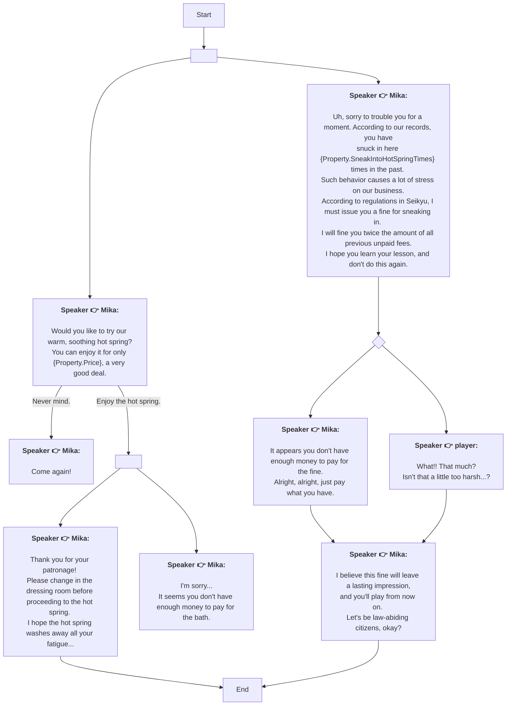

```mermaid
graph
Start -->1767303893488499[ ]
1767303893488499 -->1766332311608065[<b>Speaker 👉 Mika:</b>
\nWould you like to try our warm, soothing hot spring?
You can enjoy it for only &lbrace;Property.Price&rbrace;, a very good deal.]
1767303893488499 -->1767303935431540[<b>Speaker 👉 Mika:</b>
\nUh, sorry to trouble you for a moment. According to our records, you have
snuck in here &lbrace;Property.SneakIntoHotSpringTimes&rbrace; times in the past. 
Such behavior causes a lot of stress on our business.\nAccording to regulations in Seikyu, I must issue you a fine for sneaking in. 
I will fine you twice the amount of all previous unpaid fees.
I hope you learn your lesson, and don't do this again.]
1766332311608065 -->|Never mind.|1766332464329479[<b>Speaker 👉 Mika:</b>
\nCome again!]
1766332311608065 -->|Enjoy the hot spring.|1767448601822069[ ]
1767448601822069 -->1766336570455822[<b>Speaker 👉 Mika:</b>
\nThank you for your patronage! 
Please change in the dressing room before proceeding to the hot spring. 
I hope the hot spring washes away all your fatigue...]
1767448601822069 -->1766336717079312[<b>Speaker 👉 Mika:</b>
\nI'm sorry...
It seems you don't have enough money to pay for the bath.]
1766336570455822 -->1766336935867153[End]
1767303935431540 -->1767306199809907{ }
1767306199809907 -->1767306465960822[<b>Speaker 👉 Mika:</b>
\nIt appears you don't have enough money to pay for the fine.
Alright, alright, just pay what you have.]
1767306199809907 -->1767306336520052[<b>Speaker 👉 player:</b>
\nWhat!! That much?
Isn't that a little too harsh...?]
1767306465960822 -->1767306383012725[<b>Speaker 👉 Mika:</b>
\nI believe this fine will leave a lasting impression,
and you'll play from now on. 
Let's be law-abiding citizens, okay?]
1767306383012725 -->1766336935867153[End]
1767306336520052 -->1767306383012725[<b>Speaker 👉 Mika:</b>
\nI believe this fine will leave a lasting impression,
and you'll play from now on. 
Let's be law-abiding citizens, okay?]

```