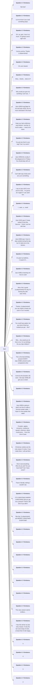

```mermaid
graph LR
Start -->1775548820281696[<b>Speaker 👉 Kinntarou:</b>
\nBye bye!]
Start -->1775548820281700[<b>Speaker 👉 Kinntarou:</b>
\nLet me know if you cook something tasty!]
Start -->1775548820281704[<b>Speaker 👉 Kinntarou:</b>
\nOh. my. god. I love it so much. I'm going to eat it right now!]
Start -->1775548820281708[<b>Speaker 👉 Kinntarou:</b>
\nYummy yummy. Thanks &lbrace;c.playername&rbrace;!]
Start -->1775548820281712[<b>Speaker 👉 Kinntarou:</b>
\nOh cool, thanks!]
Start -->1775548820281716[<b>Speaker 👉 Kinntarou:</b>
\nWow... thanks... what is it?]
Start -->1775548820281720[<b>Speaker 👉 Kinntarou:</b>
\nWhy would you give me somthing I can't eat...?]
Start -->1775548820281724[<b>Speaker 👉 Kinntarou:</b>
\n&lbrace;npc.4208&rbrace; hung flags for me and &lbrace;npc.4102&rbrace;, but I'm more interested in the food!]
Start -->1775548820281728[<b>Speaker 👉 Kinntarou:</b>
\nHope you had a delicious carp festival. I ate like 14 mochi cakes... I need to lie down.]
Start -->1775548820281732[<b>Speaker 👉 Kinntarou:</b>
\nYou got any food in your bag? Can I try some?]
Start -->1775548820281736[<b>Speaker 👉 Kinntarou:</b>
\n&lbrace;npc.4208&rbrace; lets us play in the playground on Fridays. You should play with us!]
Start -->1775548820281740[<b>Speaker 👉 Kinntarou:</b>
\nCan't talk! &lbrace;npc.4102&rbrace; and I are up to something.]
Start -->1775548820281744[<b>Speaker 👉 Kinntarou:</b>
\nI sat on &lbrace;npc.4207&rbrace; once and he cried... I'm gonna do it again if I can catch him.]
Start -->1775548820281748[<b>Speaker 👉 Kinntarou:</b>
\nI...want...a...treat!]
Start -->1775548820281752[<b>Speaker 👉 Kinntarou:</b>
\n&lbrace;npc.4102&rbrace; says if I keep eating I'll look like Daruma... I think I can live with that.]
Start -->1775548820281756[<b>Speaker 👉 Kinntarou:</b>
\n&lbrace;npc.4208&rbrace; says I have to play outside during the day, but I'd rather be in the kitchen.]
Start -->1775548820281760[<b>Speaker 👉 Kinntarou:</b>
\nIt's past my bedtime... &lt;i&gt;yawn&lt;/i&gt;...]
Start -->1775548820281764[<b>Speaker 👉 Kinntarou:</b>
\n&lbrace;npc.4208&rbrace; is teaching me how to cook!]
Start -->1775548820281768[<b>Speaker 👉 Kinntarou:</b>
\nWow, this is great &lbrace;c.playername&rbrace;! No way I'm sharing this with &lbrace;npc.4102&rbrace;.]
Start -->1775548820281772[<b>Speaker 👉 Kinntarou:</b>
\nThanks, &lbrace;c.playername&rbrace;! you can expect a thank you card in 3 to 5 months.]
Start -->1775548820281776[<b>Speaker 👉 Kinntarou:</b>
\nYou could have gotten me any kind of food but instead you got... this?]
Start -->1775548820281780[<b>Speaker 👉 Kinntarou:</b>
\nWhy... why would you do this to me. It's my birthday. Do you hate children?]
Start -->1775548820281784[<b>Speaker 👉 Kinntarou:</b>
\nThis is the best birthday present EVER!!! &lbrace;npc.4208&rbrace;'s present sucks compaired to this!]
Start -->1775548820281788[<b>Speaker 👉 Kinntarou:</b>
\nCome by the &lbrace;location.16&rbrace; soon. I bet &lbrace;npc.4208&rbrace; will give you a snack.]
Start -->1775548820281792[<b>Speaker 👉 Kinntarou:</b>
\n-]
Start -->1775548820281796[<b>Speaker 👉 Kinntarou:</b>
\n&lbrace;npc.4208&rbrace; is going to teach me how to make a Summer potato salad... I hope it's more potato than salad.]
Start -->1775548820281800[<b>Speaker 👉 Kinntarou:</b>
\nPumpkin, apples, cinnamon, cranberrys, squash, chesnuts, stews, mushrooms... I love this time of year.]
Start -->1775548820281804[<b>Speaker 👉 Kinntarou:</b>
\nChristmas cookies are the only reason I'm alive. If you make them, I will eat them.]
Start -->1775548820281808[<b>Speaker 👉 Kinntarou:</b>
\nI like to eat everything. Why do you ask? Do you have food? Can I have some?]
Start -->1775548820281812[<b>Speaker 👉 Kinntarou:</b>
\nThere's literally nothing I wouldn't eat.]
Start -->1775548820281816[<b>Speaker 👉 Kinntarou:</b>
\nIT'S CHRISTMAS! MERRY CHRISTMAS! Did you get me a present? There's still time if you didn't.]
Start -->1775548820281820[<b>Speaker 👉 Kinntarou:</b>
\nBye bye, &lbrace;c.playername&rbrace;, and MERRY CHRISTMAS EVERYONE!]
Start -->1775548820281824[<b>Speaker 👉 Kinntarou:</b>
\n-]
Start -->1775548820281828[<b>Speaker 👉 Kinntarou:</b>
\n-]
Start -->1775548820281832[<b>Speaker 👉 Kinntarou:</b>
\n-]
Start -->1775548820281836[<b>Speaker 👉 Kinntarou:</b>
\n-]
Start -->1775548820281840[<b>Speaker 👉 Kinntarou:</b>
\n-]
Start -->1775548820281844[<b>Speaker 👉 Kinntarou:</b>
\n-]
Start -->1775548820281848[<b>Speaker 👉 Kinntarou:</b>
\nThis rainy season seems endless...]
Start -->1775548820281852[<b>Speaker 👉 Kinntarou:</b>
\nI fear this will be my last rainy season. If only the rain were drops of wine... at least then I'd die happy.]
Start -->1775548820281856[<b>Speaker 👉 Kinntarou:</b>
\n0]
Start -->1775548820281860[<b>Speaker 👉 Kinntarou:</b>
\n0]
Start -->1775548820281864[<b>Speaker 👉 Kinntarou:</b>
\n0]
Start -->1775548820281868[<b>Speaker 👉 Kinntarou:</b>
\n0]

```