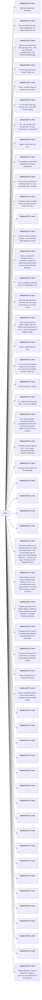

```mermaid
graph LR
Start -->1775551896511344[<b>Speaker 👉 Leon:</b>
\nMay Inari guide your footsteps.]
Start -->1775551896511348[<b>Speaker 👉 Leon:</b>
\nYou can never have too many experiences. Go explore while you can!]
Start -->1775551896511352[<b>Speaker 👉 Leon:</b>
\nWhat do you get the man who has seen it all... well, this. Thank you, &lbrace;c.playername&rbrace;, I will cherish this gift greatly.]
Start -->1775551896511356[<b>Speaker 👉 Leon:</b>
\nThis will go nicely in the temple. Thank you.]
Start -->1775551896511360[<b>Speaker 👉 Leon:</b>
\nHmm, I wonder where I'll put this in the temple.]
Start -->1775551896511364[<b>Speaker 👉 Leon:</b>
\nI'm not sure I have any room for this on my shelf. Thanks anyway.]
Start -->1775551896511368[<b>Speaker 👉 Leon:</b>
\nOh... this can go in the donation bin. I'm sure &lt;i&gt;someone&lt;/i&gt; will want it.]
Start -->1775551896511372[<b>Speaker 👉 Leon:</b>
\nHappy carp festival you two.]
Start -->1775551896511376[<b>Speaker 👉 Leon:</b>
\nYui should be proud of this celebration. Do enjoy yourselves!]
Start -->1775551896511380[<b>Speaker 👉 Leon:</b>
\nSo nice of you and Kon to visit the temple. I'm sure Inari smiles upon you both.]
Start -->1775551896511384[<b>Speaker 👉 Leon:</b>
\nI maintain a strict schedule every day. Routine frees the mind to roam.]
Start -->1775551896511388[<b>Speaker 👉 Leon:</b>
\n-]
Start -->1775551896511392[<b>Speaker 👉 Leon:</b>
\nI have to clean the Chozu-ya often... don't want the water getting scummy!]
Start -->1775551896511396[<b>Speaker 👉 Leon:</b>
\nHave you asked the blessing rock for a blessing? I've been all around the world, but this rock here gives the best blessings.]
Start -->1775551896511400[<b>Speaker 👉 Leon:</b>
\nI like to meditate under this tree. You should give it a try.]
Start -->1775551896511404[<b>Speaker 👉 Leon:</b>
\nSeize the day, little foxes. You think I saw the world while sitting on my bum? No sir!]
Start -->1775551896511408[<b>Speaker 👉 Leon:</b>
\nI love curling up with a book at night. If you still haven't read 'Adventures of Leon&quot;, I can't recommend it hightly enough.]
Start -->1775551896511412[<b>Speaker 👉 Leon:</b>
\nRain is a blessing from Inari.]
Start -->1775551896511416[<b>Speaker 👉 Leon:</b>
\nI'm a man of very specific tastes, but you've done very well with this brithday present. Thank you.]
Start -->1775551896511420[<b>Speaker 👉 Leon:</b>
\nOh, isn't that nice. Thanks.]
Start -->1775551896511424[<b>Speaker 👉 Leon:</b>
\nAh, I might offer this to Inari later... no it's not regifting.]
Start -->1775551896511428[<b>Speaker 👉 Leon:</b>
\nI am a learned priest... what did you think to accomplish with this gift? I worry you have gone astray. You will be in my prayers.]
Start -->1775551896511432[<b>Speaker 👉 Leon:</b>
\nI thought I'd seen it all, but this... this is a truly spectacular birthday present. Thank you!]
Start -->1775551896511436[<b>Speaker 👉 Leon:</b>
\nI must be off, Yui needs me for something.]
Start -->1775551896511440[<b>Speaker 👉 Leon:</b>
\n-]
Start -->1775551896511444[<b>Speaker 👉 Leon:</b>
\n-]
Start -->1775551896511448[<b>Speaker 👉 Leon:</b>
\n-]
Start -->1775551896511452[<b>Speaker 👉 Leon:</b>
\n-]
Start -->1775551896511456[<b>Speaker 👉 Leon:</b>
\nThis heat reminds me of crossing a desert on camel back years ago. It was locust season and our guide was a three-fingered toad-man... Oh there I go again. I'll spare you the longwinded story!]
Start -->1775551896511460[<b>Speaker 👉 Leon:</b>
\nWith Summer over, it's back to tutoring Yohji, Liliana, and Yui. I've somewhat given up on young Sasaki. You could have his spot in class if you'd like!]
Start -->1775551896511464[<b>Speaker 👉 Leon:</b>
\nPeople pray more in the Winter months. I believe it has something to do with boredom, or perhaps Christmas presents.]
Start -->1775551896511468[<b>Speaker 👉 Leon:</b>
\nThroughout all my travels, I've always been partial to the spicy foods of my hometown.]
Start -->1775551896511472[<b>Speaker 👉 Leon:</b>
\nI've never had much of a sweet tooth. I've always found sweets somewhat... empty.]
Start -->1775551896511476[<b>Speaker 👉 Leon:</b>
\nMerry Christmas to my merry pair of foxes.]
Start -->1775551896511480[<b>Speaker 👉 Leon:</b>
\nHave a wonderful holiday. And my book makes a great last minute stocking stuffer.]
Start -->1775551896511484[<b>Speaker 👉 Leon:</b>
\n-]
Start -->1775551896510464[<b>Speaker 👉 Leon:</b>
\n-]
Start -->1775551896510468[<b>Speaker 👉 Leon:</b>
\n-]
Start -->1775551896510472[<b>Speaker 👉 Leon:</b>
\n-]
Start -->1775551896510476[<b>Speaker 👉 Leon:</b>
\n-]
Start -->1775551896510480[<b>Speaker 👉 Leon:</b>
\n-]
Start -->1775551896510484[<b>Speaker 👉 Leon:</b>
\n-]
Start -->1775551896510488[<b>Speaker 👉 Leon:</b>
\n-]
Start -->1775551896510492[<b>Speaker 👉 Leon:</b>
\n-]
Start -->1775551896510496[<b>Speaker 👉 Leon:</b>
\n-]
Start -->1775551896510500[<b>Speaker 👉 Leon:</b>
\n-]
Start -->1775551896510504[<b>Speaker 👉 Leon:</b>
\n-]
Start -->1775551896510508[<b>Speaker 👉 Leon:</b>
\n-]
Start -->1775551896510512[<b>Speaker 👉 Leon:</b>
\n-]
Start -->1775551896510516[<b>Speaker 👉 Leon:</b>
\n-]
Start -->1775551896510520[<b>Speaker 👉 Leon:</b>
\n-]
Start -->1775551896510524[<b>Speaker 👉 Leon:</b>
\n-]
Start -->1777985833497131[<b>Speaker 👉 Leon:</b>
\nI detest violence. I have no interests in weapons, armor, or any impliments of war. Barbaric!]

```