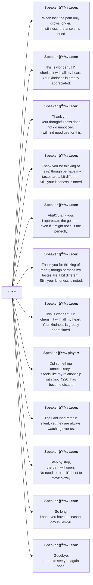

```mermaid
graph LR
Start -->1727291147077752[<b>Speaker 👉 Leon:</b>
\nWhen lost, the path only grows longer. 
In stillness, the answer is found.]
Start -->1727291569674366[<b>Speaker 👉 Leon:</b>
\nThis is wonderful! I'll cherish it with all my heart. 
Your kindness is greatly appreciated.]
Start -->1727291569674368[<b>Speaker 👉 Leon:</b>
\nThank you. 
Your thoughtfulness does not go unnoticed. 
I will find good use for this.]
Start -->1727291569675396[<b>Speaker 👉 Leon:</b>
\nThank you for thinking of me… though perhaps my tastes are a bit different. Still, your kindness is noted.]
Start -->1727291569675394[<b>Speaker 👉 Leon:</b>
\nAh… thank you. 
I appreciate the gesture, 
even if it might not suit me perfectly.]
Start -->1727291569675398[<b>Speaker 👉 Leon:</b>
\nThank you for thinking of me… though perhaps my tastes are a bit different. 
Still, your kindness is noted.]
Start -->1727291569675400[<b>Speaker 👉 Leon:</b>
\nThis is wonderful! I'll cherish it with all my heart. 
Your kindness is greatly appreciated.]
Start -->1727291569676426[<b>Speaker 👉 player:</b>
\nDid something unnecessary...
It feels like my relationship with &lbrace;npc.4220&rbrace; has become distant!]
Start -->1727291716105364[<b>Speaker 👉 Leon:</b>
\nThe God Inari remain silent, yet they are always watching over us.]
Start -->1756938432158782[<b>Speaker 👉 Leon:</b>
\nStep by step, 
the path will open. 
No need to rush; it's best to move slowly.]
Start -->1758882749960786[<b>Speaker 👉 Leon:</b>
\nSo long,
I hope you have a pleasant day in Seikyu.]
Start -->1758882753961555[<b>Speaker 👉 Leon:</b>
\nGoodbye,
I hope to see you again soon.]

```