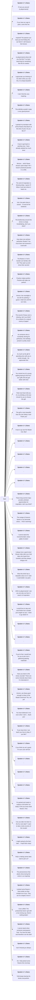

```mermaid
graph LR
Start -->1775339972760734[<b>Speaker 👉 Liliana:</b>
\nI'll see you around &lbrace;c.playername&rbrace;!]
Start -->1775339972760738[<b>Speaker 👉 Liliana:</b>
\nIf you have an urge to paint, come find me.]
Start -->1775339972760742[<b>Speaker 👉 Liliana:</b>
\nInspired! The passion you have put into finding this... I can feel it! I will treasure this forever.]
Start -->1775339972760746[<b>Speaker 👉 Liliana:</b>
\n&lbrace;c.playername&rbrace; where did you find this? I've been searching for something like this for weeks!]
Start -->1775339972760750[<b>Speaker 👉 Liliana:</b>
\nI appreciate you thinking of me when when you saw this, it's simply beautiful!]
Start -->1775339972760754[<b>Speaker 👉 Liliana:</b>
\nI don't find this very inspiring.]
Start -->1775339972760758[<b>Speaker 👉 Liliana:</b>
\nThis definitly wouldn't make a very good picture!]
Start -->1775339972760762[<b>Speaker 👉 Liliana:</b>
\nI painted my koinobori with all the flowers that bloom at this time of year. Do you like it?]
Start -->1775339972760766[<b>Speaker 👉 Liliana:</b>
\nI have to get back to painting now, I have already waisted too much time!]
Start -->1775339972760770[<b>Speaker 👉 Liliana:</b>
\nMmmm... which flower should I paint today? Ah! I haven't practiced peonies in a while.]
Start -->1775339972760774[<b>Speaker 👉 Liliana:</b>
\nThe wind of inspiration is blowing today, I guess I'll follow it and see where it leads me.]
Start -->1775339972760778[<b>Speaker 👉 Liliana:</b>
\nHuh, the paint shop is closed... it must be the weekend.]
Start -->1775339972760782[<b>Speaker 👉 Liliana:</b>
\nThe biodiversity around the shrine is simply breathtaking, don't you think?]
Start -->1775339972760786[<b>Speaker 👉 Liliana:</b>
\nHow does one achieve perfection Shuten? You must have met someone I could ask!.]
Start -->1775339972760790[<b>Speaker 👉 Liliana:</b>
\nThe flowers in Yoni's Garden are familiar with me! They open up and show thier secrets!]
Start -->1775339972760794[<b>Speaker 👉 Liliana:</b>
\nPractice makes perfect. Practice will make me perfect!]
Start -->1775339972760798[<b>Speaker 👉 Liliana:</b>
\nHmmm, the moonlight is too dim for painting. I guess I shall rest until the sun rises.]
Start -->1775339972760802[<b>Speaker 👉 Liliana:</b>
\nThe sound of heavy rain is relaxing, don't you think? It's a shame it's a natural enemy of paper!]
Start -->1775339972760806[<b>Speaker 👉 Liliana:</b>
\nAs someone who is constantly striving for perfection, this birthday present is pretty close!]
Start -->1775339972760810[<b>Speaker 👉 Liliana:</b>
\nAs much as the gift of spending time with you is surely enough, I do appreciate this!]
Start -->1775339972760814[<b>Speaker 👉 Liliana:</b>
\nYou remind me of a young sapling baring its first fruit - your gifts will only get better with time!]
Start -->1775339972760818[<b>Speaker 👉 Liliana:</b>
\nYohji must have told you it's my birthday at the last minute for you to choose this gift.]
Start -->1775339972760822[<b>Speaker 👉 Liliana:</b>
\nThis gift is more beautiful than the rare Seikyu rose! Thank you!]
Start -->1775339972760826[<b>Speaker 👉 Liliana:</b>
\nI have to go see the Master now. Bye!]
Start -->1775339972760830[<b>Speaker 👉 Liliana:</b>
\n-]
Start -->1775339972760834[<b>Speaker 👉 Liliana:</b>
\n-]
Start -->1775339972760838[<b>Speaker 👉 Liliana:</b>
\n-]
Start -->1775339972760842[<b>Speaker 👉 Liliana:</b>
\n-]
Start -->1775339972760846[<b>Speaker 👉 Liliana:</b>
\nThese long summer days provide unlimited opportunities for inspriation, don't you think?]
Start -->1775339972760850[<b>Speaker 👉 Liliana:</b>
\nThe orange of Autumn leaves is my favourate colour... I find it warming!]
Start -->1775339972760854[<b>Speaker 👉 Liliana:</b>
\nI cannot stand the monochromatic colour pallet of winter!]
Start -->1775339972760858[<b>Speaker 👉 Liliana:</b>
\nI always love a good story! Shuten often tells me of old tales she heard from travelers and they always intrigue me!]
Start -->1775339972760862[<b>Speaker 👉 Liliana:</b>
\nWow this drink has a beautiful colour to it! I wish I could bottle it as paint.]
Start -->1775339972760866[<b>Speaker 👉 Liliana:</b>
\nAhhh &lbrace;c.playername&rbrace;! I see you are also out here in search of inspiration.]
Start -->1775339972760870[<b>Speaker 👉 Liliana:</b>
\nI would love to stay and chat further but a wreath just caught my eye. I need to go sketch it!]
Start -->1775339972760874[<b>Speaker 👉 Liliana:</b>
\n-]
Start -->1775339972760878[<b>Speaker 👉 Liliana:</b>
\n-]
Start -->1775339972760882[<b>Speaker 👉 Liliana:</b>
\nIf you're free I would love for you to join me in gathering painting materials!]
Start -->1775339972760886[<b>Speaker 👉 Liliana:</b>
\nHave you been to the mines recently? There are some minerals down there I'm interested in!]
Start -->1775339972760890[<b>Speaker 👉 Liliana:</b>
\nHmmm, are these good enough to show to the Master tomorrow? No, not yet!]
Start -->1775339972760894[<b>Speaker 👉 Liliana:</b>
\nYou have believed in me even when I don't... thank you!]
Start -->1775339972760898[<b>Speaker 👉 Liliana:</b>
\nIf you have time I can teach you how to draw, if you like?]
Start -->1775339972760902[<b>Speaker 👉 Liliana:</b>
\nIf you think my art is good, I'm sure Leon will too!]
Start -->1775339972760906[<b>Speaker 👉 Liliana:</b>
\n-]
Start -->1775339972760910[<b>Speaker 👉 Liliana:</b>
\n-]
Start -->1775339972760914[<b>Speaker 👉 Liliana:</b>
\n-]
Start -->1775339972760918[<b>Speaker 👉 Liliana:</b>
\nI'm packed and ready to explore a bit further out today! I'll let you know what flowers I find.]
Start -->1775339972760922[<b>Speaker 👉 Liliana:</b>
\nCan you take me down to the fox ruins later? I want to take a look at some of the murals!]
Start -->1775339972760926[<b>Speaker 👉 Liliana:</b>
\nI might swing by the farm later... I hope that's okay!]
Start -->1775339972760930[<b>Speaker 👉 Liliana:</b>
\nYohji is making ramen later, want to join us?]
Start -->1775339972760934[<b>Speaker 👉 Liliana:</b>
\nThe perseverence that plants show during the winter is so inspiring!]
Start -->1775339972760938[<b>Speaker 👉 Liliana:</b>
\nI picked some flowers I drew earlier as they rimided me of you. They are fox shaped, kind of.]
Start -->1777902725579198[<b>Speaker 👉 Liliana:</b>
\nI love coffee! The productivity boost I get with a nice strong cup, there's nothing better!]
Start -->1777903713635778[<b>Speaker 👉 Liliana:</b>
\nI cannot stand when someone overseasons food. You lose the taste and therefore ruin the dish!]
Start -->1777903733935558[<b>Speaker 👉 Liliana:</b>
\nIvan! Amazing as always.]
Start -->1777903786446282[<b>Speaker 👉 Liliana:</b>
\nOh, Yohji picked some flowers this morning!]
Start -->1777903809186254[<b>Speaker 👉 Liliana:</b>
\nYohji keeps leaving his books everywhere.]

```