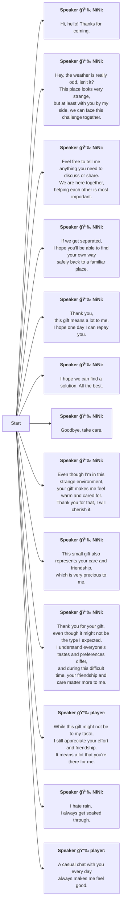

```mermaid
graph LR
Start -->1734730740230258[<b>Speaker 👉 NiNi:</b>
\nHi, hello! Thanks for coming.]
Start -->1734730744063091[<b>Speaker 👉 NiNi:</b>
\nHey, the weather is really odd, isn't it?
This place looks very strange,
but at least with you by my side, we can face this challenge together.]
Start -->1734730747935860[<b>Speaker 👉 NiNi:</b>
\nFeel free to tell me anything you need to discuss or share.
We are here together,
helping each other is most important.]
Start -->1734731567891567[<b>Speaker 👉 NiNi:</b>
\nIf we get separated,
I hope you'll be able to find your own way
safely back to a familiar place.]
Start -->1734731733276786[<b>Speaker 👉 NiNi:</b>
\nThank you,
this gift means a lot to me.
I hope one day I can repay you.]
Start -->1734731595610224[<b>Speaker 👉 NiNi:</b>
\nI hope we can find a solution. All the best.]
Start -->1734731600038001[<b>Speaker 👉 NiNi:</b>
\nGoodbye, take care.]
Start -->1734732020340855[<b>Speaker 👉 NiNi:</b>
\nEven though I'm in this strange environment,
your gift makes me feel warm and cared for.
Thank you for that, I will cherish it.]
Start -->1734732140215416[<b>Speaker 👉 NiNi:</b>
\nThis small gift also represents your care and friendship,
which is very precious to me.]
Start -->1734732145267833[<b>Speaker 👉 NiNi:</b>
\nThank you for your gift, even though it might not be the type I expected.
I understand everyone's tastes and preferences differ,
and during this difficult time, your friendship and care matter more to me.]
Start -->1734732156119162[<b>Speaker 👉 player:</b>
\nWhile this gift might not be to my taste,
I still appreciate your effort and friendship.
It means a lot that you're there for me.]
Start -->1734733236163709[<b>Speaker 👉 NiNi:</b>
\nI hate rain, 
I always get soaked through.]
Start -->1734733242721406[<b>Speaker 👉 player:</b>
\nA casual chat with you every day
always makes me feel good.]

```