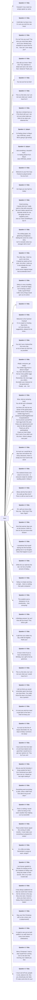

```mermaid
graph LR
Start -->1730217004590177[<b>Speaker 👉 Oda:</b>
\nFarewell. If you need me simply speak my name.]
Start -->1730217216536675[<b>Speaker 👉 Oda:</b>
\nI shall take my leave now, I'm sure you and Kon are busy!]
Start -->1730233993071725[<b>Speaker 👉 Oda:</b>
\nFor me? Are you sure? The time you must have taken out of your already busy schedule to source this for me... how can I ever repay you?]
Start -->1730233993072751[<b>Speaker 👉 Oda:</b>
\nHow did you know I liked this? Your attention to detail and care is far more than I deserve! Thank you!]
Start -->1730233993072753[<b>Speaker 👉 Oda:</b>
\nYou two are far too kind!]
Start -->1730233993072755[<b>Speaker 👉 Oda:</b>
\nThis is a fine item, but I am not sure what use I would have for it!]
Start -->1730233993073781[<b>Speaker 👉 Oda:</b>
\nMy time is limited here so I'll be blunt with you! I am not sure what made you think of me when you obtained this.]
Start -->1730233993073783[<b>Speaker 👉 player:</b>
\nI'm feeling closer to Mayor &lbrace;npc.4209.last_name&rbrace;...
We're going to get along!]
Start -->1730233993073785[<b>Speaker 👉 player:</b>
\nI did something I shouldn't have...
I'm feeling distant from Mayor &lbrace;npc.4209.last_name&rbrace;!]
Start -->1753123160870296[<b>Speaker 👉 Oda:</b>
\nWelcome to your first Carp Festival &lbrace;c.playername&rbrace;! You too Kon!]
Start -->1753123460401561[<b>Speaker 👉 Oda:</b>
\nI do hope you two had fun today!]
Start -->1757989735854647[<b>Speaker 👉 Oda:</b>
\nGood evening... 
I barely drink but I really want to chat with everyone.\nMy aunt makes special non-alcoholic drinks for me,
like ginger ale and raspberry juice...
Just so I have something to sip on.]
Start -->1757990030330425[<b>Speaker 👉 Oda:</b>
\nThe shifting lights, the glistening wineglasses...
Setting the scene for a love story.
Isn't it romantic when two strangers fall in love?]
Start -->1757990760116796[<b>Speaker 👉 Oda:</b>
\nThe other day, I tried my aunt's new brew.
It tasted as sweet as fruit juice, but when I woke up,
it was already the next afternoon.\nIs this some magical trinket that accelerates time?!]
Start -->1758097679938149[<b>Speaker 👉 Oda:</b>
\nSeikyu is now a bustling town; I should be happy,
but is having a casino really a good thing?
I often worry things would spin out of control.]
Start -->1758100491311719[<b>Speaker 👉 Oda:</b>
\n]
Start -->1758249243877977[<b>Speaker 👉 Oda:</b>
\nWelcome to the Summer Festival!
I'm no expert on hosting big events,
so if you have any suggestions, please let me know...]
Start -->1758249694724699[<b>Speaker 👉 Oda:</b>
\nYou don't see a festival like this every day,
so try to have as much fun as possible!]
Start -->1769153395688482[<b>Speaker 👉 Oda:</b>
\nAlright, everyone, get ready! 
The Golden Egg Hunt is about to begin!\nYou have 180 seconds to find as many golden eggs as possible.
Remember, the more eggs you collect, 
the better your chances for the grand prize!\nReady... set... Go!]
Start -->1769153431311396[<b>Speaker 👉 Oda:</b>
\nWow, what an amazing hunt! 
You all did such a fantastic job, 
but there can only be one winner of the grand prize!\nAnd the winner of this year's Golden Egg Hunt is... 
&lbrace;property.GoldenEggWinner&rbrace;!\nCongratulations! 
You've proven yourself the best egg hunter this year. 
Enjoy your special prize and wear the title with pride!\nThank you all for participating! 
I hope you had a blast. 
Don't worry if you didn't win this time—there's always next year!]
Start -->1775162815304726[<b>Speaker 👉 Oda:</b>
\nAs much as I would like to stay here and admire the cherry blossoms, there is simply too much work to be done!]
Start -->1775163103296538[<b>Speaker 👉 Oda:</b>
\nThe weekend draws ever closer to to its end... is everyone ready for another bustling week in Seikyu?]
Start -->1775163107154971[<b>Speaker 👉 Oda:</b>
\nWhere did the first half of the week go Miss Ama? There is still so much to do!]
Start -->1775164372485149[<b>Speaker 👉 Oda:</b>
\nOh, well you know what they say - Work hard, Play hard. Right?]
Start -->1775164416326688[<b>Speaker 👉 Oda:</b>
\nNow that warmer days are on the horizon I think it's time for the you-know-what Shuten!]
Start -->1775164420689953[<b>Speaker 👉 Oda:</b>
\nI sometimes find myself staring into this fountain getting lost in my thoughts. Does that happen to you?]
Start -->1775164711722024[<b>Speaker 👉 Oda:</b>
\nWhile the sun adornes the sky I am but a humble servent of Seikyu.]
Start -->1775164732277801[<b>Speaker 👉 Oda:</b>
\nSeikyu is simply stunning at night... there is nothing that quite compares!]
Start -->1775164532912166[<b>Speaker 👉 Oda:</b>
\nThis weather puts a dampener on my productivity... how annoying!]
Start -->1775166031622193[<b>Speaker 👉 Oda:</b>
\nA Birthday present, for me? How did you know? This, what a gift!]
Start -->1775166031623219[<b>Speaker 👉 Oda:</b>
\nA gift from you makes my day a little bit brighter, thank you!]
Start -->1775166031624245[<b>Speaker 👉 Oda:</b>
\nIt truly is kind of you to have remembered my Birthday, but a gift is far too generous.]
Start -->1775166031624247[<b>Speaker 👉 Oda:</b>
\nThis is a fine item, but I am not sure what use I would have for it!]
Start -->1775166031625275[<b>Speaker 👉 Oda:</b>
\nI did not think you would remember given how busy you have been. You really know the way to my heart... this is perfect!]
Start -->1775166218007617[<b>Speaker 👉 Oda:</b>
\nI'm sure you and Kon need to get back to the farm, I shall not keep you!]
Start -->1775166226185284[<b>Speaker 👉 Oda:</b>
\nAs much as this line of inquiry fascinates me, my duty to Seikyu summons me away!]
Start -->1775166218007618[<b>Speaker 👉 Oda:</b>
\nI have some free time later on and have baked some good that I would love to get your opinion on!  Pop by if you can!]
Start -->1775166486298698[<b>Speaker 👉 Oda:</b>
\nDid you see the Koinobori I hung outside the farm? Kon mentioned you didn't have one so I stayed up last night making it!]
Start -->1775166486299724[<b>Speaker 👉 Oda:</b>
\nEverything went according to plan, what a relief! Now how about we go and relax?]
Start -->1775166589369426[<b>Speaker 👉 Oda:</b>
\nThere is nothing I would rather be doing in this warm weather than helping out my townsfolk!]
Start -->1775166628730970[<b>Speaker 👉 Oda:</b>
\nThese amber leaves signal the coming of colder months. I must make sure everything is prepared for winter!]
Start -->1775166633910364[<b>Speaker 👉 Oda:</b>
\nIt is chilly out today. Remember to wrap up warm, alright?]
Start -->1775166811015263[<b>Speaker 👉 Oda:</b>
\nI am forever grateful to Shuten for looking out for the residents of Seikyu and being the holder of their secrets. She is my most trusted ally!]
Start -->1775166820796512[<b>Speaker 👉 Oda:</b>
\nIt has always saddened me that we could never restore the fox shrines to the way they once were. However, since you have come to Seikyu they've looked a lot better!]
Start -->1775172156249857[<b>Speaker 👉 Oda:</b>
\nMay your first Christmas with us be a merry one &lbrace;c.playername&rbrace;!]
Start -->1775172164922114[<b>Speaker 👉 Oda:</b>
\nI'm glad to see you've both settled in so well! Here's to many more festive celebrations.]
Start -->1775172166556419[<b>Speaker 👉 Oda:</b>
\nMerry Christmas! I had to stop myself from coming over to the farm this morning, but I baked you this!]
Start -->1775172173178628[<b>Speaker 👉 Oda:</b>
\nI must rush off now, people to see, places to be. But, you should pop over later, I'll make some time for you!]

```