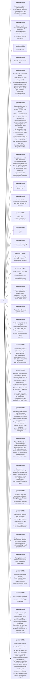

```mermaid
graph LR
Start -->1730212391192667[<b>Speaker 👉 Oda:</b>
\nGreetings. I see you're in high spirits today...
If you need any help, don't hesitate to reach out!\nAfter all, it's my duty to serve!]
Start -->1730213165787229[<b>Speaker 👉 Oda:</b>
\nHow's it going?
You seem to be in a great mood today...
Got any good news?\nI'm so sorry, I didn't mean to pry.
I'm not always good with boundaries.]
Start -->1730217004590177[<b>Speaker 👉 Oda:</b>
\nFarewell, then.]
Start -->1730217216536675[<b>Speaker 👉 Oda:</b>
\nOkay, I'll see you around then.]
Start -->1730218968869989[<b>Speaker 👉 Oda:</b>
\nEven though I was elected as mayor...
I know it's only due to my father's legacy
that people accept me.\nBut I won't be disheartened!
My father's legacy is his,
and I will create my own.\nAnyway, I'll work hard to gain everyone's acceptance.
Any help would be appreciated.]
Start -->1730220994965607[<b>Speaker 👉 Oda:</b>
\nSay, are you interested in desserts?
Kon told me you're quite the cook.
I'd love to exchange ideas with you sometime.\nYes, I'm planning to build a baking school.
I've been promoting and recruiting on social media.
I'm getting a ton of responses and it's so surprising!\nNot going to lie, I was somewhat of a celeb online.
My channel is called &quot;Oda's Baking Class&quot;.
It's trusted and loved by all.\nWhen my fans heard I was starting a school offline,
they signed up immediately and it was
far more popular than I thought it would be...]
Start -->1730233744481387[<b>Speaker 👉 Oda:</b>
\nI was just about to visit Miss Ama's store!
Musashi brought some fabric from outside recently,
and I've asked her to make a few dresses for me.\nOh, the print on the fabric is adorable...
Miss Ama said it'd be perfect for a petticoat.
I'm tingling with excitement!]
Start -->1730233993071725[<b>Speaker 👉 Oda:</b>
\nHey, nicely done!
Thanks a lot…]
Start -->1730233993072751[<b>Speaker 👉 Oda:</b>
\nYou're too kind...
I appreciate your generosity
and I really like what you gave me…]
Start -->1730233993072753[<b>Speaker 👉 Oda:</b>
\nThank you...
We don't need to be so formal with each other.]
Start -->1730233993072755[<b>Speaker 👉 Oda:</b>
\nThis...
Ugh...]
Start -->1730233993073781[<b>Speaker 👉 Oda:</b>
\nAre you intentionally trying to embarrass me?]
Start -->1730233993073783[<b>Speaker 👉 player:</b>
\nI'm feeling closer to Mayor &lbrace;npc.4209.last_name&rbrace;...
We're going to get along!]
Start -->1730233993073785[<b>Speaker 👉 player:</b>
\nI did something I shouldn't have...
I'm feeling distant from Mayor &lbrace;npc.4209.last_name&rbrace;!]
Start -->1753123160870296[<b>Speaker 👉 Oda:</b>
\n&lbrace;playername&rbrace;, welcome to the Carp Festival.
It's a big day in &lbrace;location.13&rbrace; every year.
Don't forget to join the fun at &lbrace;npc.4206&rbrace;'s booth!]
Start -->1753123460401561[<b>Speaker 👉 Oda:</b>
\nPlease, have the time of your life today!]
Start -->1757029480119432[<b>Speaker 👉 Oda:</b>
\nGood evening, nice to see you again.
Looks like you have plans for tonight. Have fun!\nSeikyu is known for being a safe town,
but still, don't go home too late...
Safety first!]
Start -->1757029824382093[<b>Speaker 👉 Oda:</b>
\nHow do you do? I am Yui Oda, mayor of the town.
You can call me Yui; everyone does.\nThis may sound like bragging, but feel free to
come to me if you run into any problem.
After all, I'm here to help.]
Start -->1730229309007977[<b>Speaker 👉 Oda:</b>
\nYou know, many years ago, Seikyu wasn't this quiet.
Back then, it was home to the foxes.
The Odas and the foxes, we go way back.\nThey protected Seikyu, and the Odas protected them.
Then something happened in my grandpa's generation and
all the foxes vanished...\nAs an Oda myself, I want to fulfill my duty,
guarding this land and waiting for the foxes' return.]
Start -->1757037204773016[<b>Speaker 👉 Oda:</b>
\nEver heard of the Teru Teru Bozu? In the past,
when the foxes were still around, they would make
these dolls and hang them under the eaves.\nThey used them to pray for good weather.
However, since the foxes were gone,
this tradition has been all but forgotten.]
Start -->1757037426456730[<b>Speaker 👉 Oda:</b>
\nAre you familiar with the Fox's Wedding?
In folklore, the foxes hold weddings on rainy days.
The brides wore white kimonos and rode in litters.\nIt's said that people should steer away from
the wedding when they see one.]
Start -->1757989735854647[<b>Speaker 👉 Oda:</b>
\nGood evening... 
I barely drink but I really want to chat with everyone.\nMy aunt makes special non-alcoholic drinks for me,
like ginger ale and raspberry juice...
Just so I have something to sip on.]
Start -->1757990030330425[<b>Speaker 👉 Oda:</b>
\nThe shifting lights, the glistening wineglasses...
Setting the scene for a love story.
Isn't it romantic when two strangers fall in love?]
Start -->1757990760116796[<b>Speaker 👉 Oda:</b>
\nThe other day, I tried my aunt's new brew.
It tasted as sweet as fruit juice, but when I woke up,
it was already the next afternoon.\nIs this some magical trinket that accelerates time?!]
Start -->1758097679938149[<b>Speaker 👉 Oda:</b>
\nSeikyu is now a bustling town; I should be happy,
but is having a casino really a good thing?
I often worry things would spin out of control.]
Start -->1758100491311719[<b>Speaker 👉 Oda:</b>
\nThe night is long and entertainment is needed.
Have a great time, &lbrace;playername&rbrace;.]
Start -->1758249243877977[<b>Speaker 👉 Oda:</b>
\nWelcome to the Summer Festival!
I'm no expert on hosting big events,
so if you have any suggestions, please let me know...]
Start -->1758249694724699[<b>Speaker 👉 Oda:</b>
\nYou don't see a festival like this every day,
so try to have as much fun as possible!]
Start -->1769153395688482[<b>Speaker 👉 Oda:</b>
\nAlright, everyone, get ready! 
The Golden Egg Hunt is about to begin!\nYou have 180 seconds to find as many golden eggs as possible.
Remember, the more eggs you collect, 
the better your chances for the grand prize!\nReady... set... Go!]
Start -->1769153431311396[<b>Speaker 👉 Oda:</b>
\nWow, what an amazing hunt! 
You all did such a fantastic job, 
but there can only be one winner of the grand prize!\nAnd the winner of this year's Golden Egg Hunt is... 
&lbrace;property.GoldenEggWinner&rbrace;!\nCongratulations! 
You've proven yourself the best egg hunter this year. 
Enjoy your special prize and wear the title with pride!\nThank you all for participating! 
I hope you had a blast. 
Don't worry if you didn't win this time—there's always next year!]

```