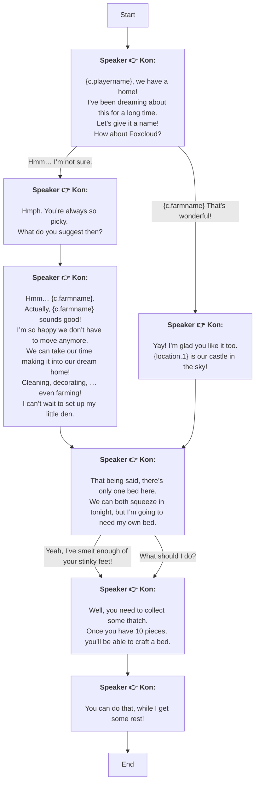

```mermaid
graph
Start -->1738387958398078[<b>Speaker 👉 Kon:</b>
\n&lbrace;c.playername&rbrace;, we have a home!
I’ve been dreaming about this for a long time.\nLet’s give it a name!
How about Foxcloud?]
1738387958398078 -->|Hmm… I’m not sure.|1738388286156932[<b>Speaker 👉 Kon:</b>
\nHmph. You’re always so picky. 
What do you suggest then?]
1738387958398078 -->|&lbrace;c.farmname&rbrace; That’s wonderful!|1738388341011589[<b>Speaker 👉 Kon:</b>
\nYay! I’m glad you like it too.
&lbrace;location.1&rbrace; is our castle in the sky!]
1738388286156932 -->1738995967017127[<b>Speaker 👉 Kon:</b>
\nHmm… &lbrace;c.farmname&rbrace;.
Actually, &lbrace;c.farmname&rbrace; sounds good!
I’m so happy we don’t have to move anymore.\nWe can take our time making it into our dream home!
Cleaning, decorating, … even farming!
I can’t wait to set up my little den.]
1738995967017127 -->1738388426918022[<b>Speaker 👉 Kon:</b>
\nThat being said, there’s only one bed here.
We can both squeeze in tonight, but I’m going to need my own bed.]
1738388426918022 -->|Yeah, I’ve smelt enough of your stinky feet!|1738388688796813[<b>Speaker 👉 Kon:</b>
\nWell, you need to collect some thatch.
Once you have 10 pieces, you’ll be able to craft a bed.]
1738388426918022 -->|What should I do?|1738388688796813[<b>Speaker 👉 Kon:</b>
\nWell, you need to collect some thatch.
Once you have 10 pieces, you’ll be able to craft a bed.]
1738388688796813 -->1738388750465166[<b>Speaker 👉 Kon:</b>
\nYou can do that, while I get some rest!]
1738388750465166 -->1738387476879485[End]
1738388341011589 -->1738388426918022[<b>Speaker 👉 Kon:</b>
\nThat being said, there’s only one bed here.
We can both squeeze in tonight, but I’m going to need my own bed.]

```