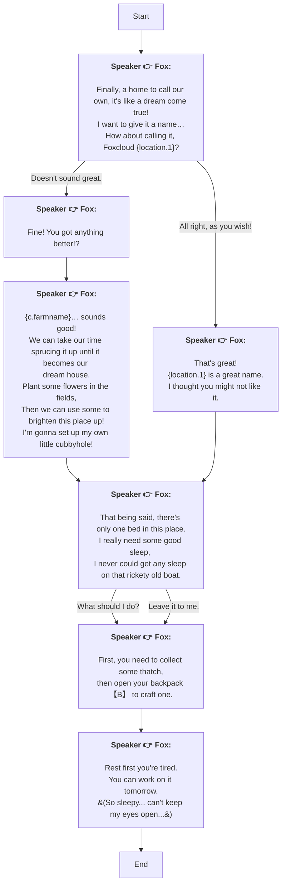

```mermaid
graph
Start -->1738387958398078[<b>Speaker 👉 Fox:</b>
\nFinally, a home to call our own, it's like a dream come true!
I want to give it a name…\nHow about calling it, Foxcloud &lbrace;location.1&rbrace;?]
1738387958398078 -->|Doesn't sound great.|1738388286156932[<b>Speaker 👉 Fox:</b>
\nFine! You got anything better!?]
1738387958398078 -->|All right, as you wish!|1738388341011589[<b>Speaker 👉 Fox:</b>
\nThat's great!
&lbrace;location.1&rbrace; is a great name.
I thought you might not like it.]
1738388286156932 -->1738995967017127[<b>Speaker 👉 Fox:</b>
\n&lbrace;c.farmname&rbrace;… sounds good!
We can take our time sprucing it up until it becomes our 
dream house.\nPlant some flowers in the fields,
Then we can use some to brighten this place up!
I'm gonna set up my own little cubbyhole!]
1738995967017127 -->1738388426918022[<b>Speaker 👉 Fox:</b>
\nThat being said, there's only one bed in this place.
I really need some good sleep, 
I never could get any sleep on that rickety old boat.]
1738388426918022 -->|What should I do?|1738388688796813[<b>Speaker 👉 Fox:</b>
\nFirst, you need to collect some thatch,
then open your backpack 【B】 to craft one.]
1738388426918022 -->|Leave it to me.|1738388688796813[<b>Speaker 👉 Fox:</b>
\nFirst, you need to collect some thatch,
then open your backpack 【B】 to craft one.]
1738388688796813 -->1738388750465166[<b>Speaker 👉 Fox:</b>
\nRest first you're tired.
You can work on it tomorrow.
&#40;So sleepy... can't keep my eyes open...&#41;]
1738388750465166 -->1738387476879485[End]
1738388341011589 -->1738388426918022[<b>Speaker 👉 Fox:</b>
\nThat being said, there's only one bed in this place.
I really need some good sleep, 
I never could get any sleep on that rickety old boat.]

```