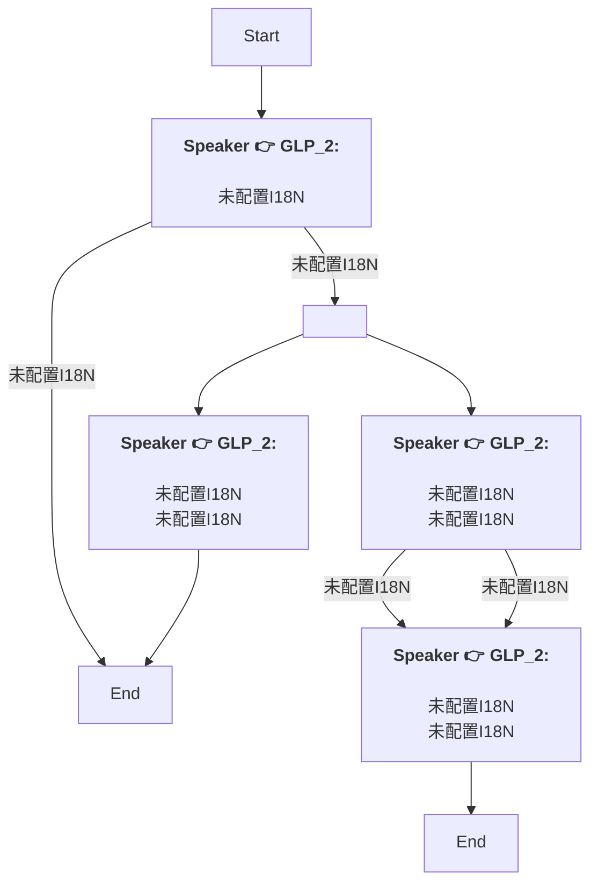

```mermaid
graph
Start -->1762069650172705[<b>Speaker 👉 GLP_2:</b>
\n未配置I18N]
1762069650172705 -->|未配置I18N|1762068838364960[End]
1762069650172705 -->|未配置I18N|1762068673981213[ ]
1762068673981213 -->1762068724088607[<b>Speaker 👉 GLP_2:</b>
\n未配置I18N\n未配置I18N]
1762068673981213 -->1762067883431701[<b>Speaker 👉 GLP_2:</b>
\n未配置I18N\n未配置I18N]
1762067883431701 -->|未配置I18N|1762068295738139[<b>Speaker 👉 GLP_2:</b>
\n未配置I18N\n未配置I18N]
1762067883431701 -->|未配置I18N|1762068295738139[<b>Speaker 👉 GLP_2:</b>
\n未配置I18N\n未配置I18N]
1762068295738139 -->1762068710496030[End]
1762068724088607 -->1762068838364960[End]

```