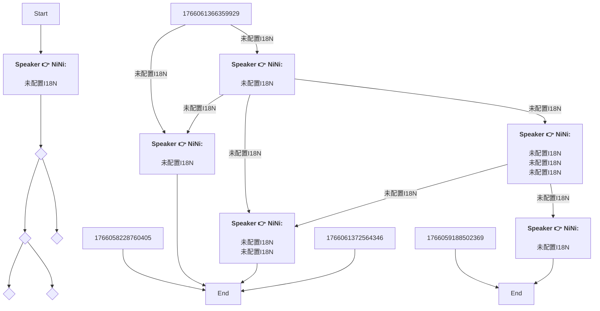

```mermaid
graph
Start -->1766058228759378[<b>Speaker 👉 NiNi:</b>
\n未配置I18N]
1766058228759378 -->1766058184354637{ }
1766058184354637 -->1766060995138419{ }
1766058184354637 -->1766058228759380{ }
1766058228760405 -->1766058228761430[End]
1766059188502369 -->1766059416893282[End]
1766060995138419 -->1766061220162424{ }
1766060995138419 -->1766058832767834{ }
1766061366359929 -->|未配置I18N|1766061471389569[<b>Speaker 👉 NiNi:</b>
\n未配置I18N]
1766061366359929 -->|未配置I18N|1766061455267712[<b>Speaker 👉 NiNi:</b>
\n未配置I18N]
1766061455267712 -->1766058228761430[End]
1766061471389569 -->|未配置I18N|1766061455267712[<b>Speaker 👉 NiNi:</b>
\n未配置I18N]
1766061471389569 -->|未配置I18N|1766061575944074[<b>Speaker 👉 NiNi:</b>
\n未配置I18N\n未配置I18N\n未配置I18N]
1766061471389569 -->|未配置I18N|1766061547048841[<b>Speaker 👉 NiNi:</b>
\n未配置I18N\n未配置I18N]
1766061547048841 -->1766058228761430[End]
1766061575944074 -->|未配置I18N|1766061898342288[<b>Speaker 👉 NiNi:</b>
\n未配置I18N]
1766061575944074 -->|未配置I18N|1766061547048841[<b>Speaker 👉 NiNi:</b>
\n未配置I18N\n未配置I18N]
1766061898342288 -->1766059416893282[End]
1766061372564346 -->1766058228761430[End]

```