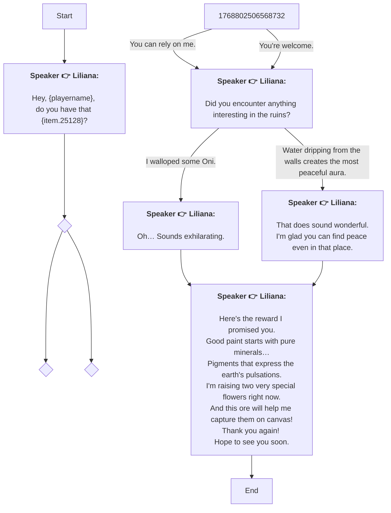

```mermaid
graph
Start -->1768802449917971[<b>Speaker 👉 Liliana:</b>
\nHey, &lbrace;playername&rbrace;, 
do you have that &lbrace;item.25128&rbrace;?]
1768802449917971 -->1768802426206226{ }
1768802426206226 -->1768802472486932{ }
1768802426206226 -->1768802491199513{ }
1768802506568732 -->|You can rely on me.|1768802614336548[<b>Speaker 👉 Liliana:</b>
\nDid you encounter anything interesting in the ruins?]
1768802506568732 -->|You're welcome.|1768802614336548[<b>Speaker 👉 Liliana:</b>
\nDid you encounter anything interesting in the ruins?]
1768802614336548 -->|I walloped some Oni.|1768802653325354[<b>Speaker 👉 Liliana:</b>
\nOh… Sounds exhilarating.]
1768802614336548 -->|Water dripping from the walls creates the most peaceful aura.|1768802663928875[<b>Speaker 👉 Liliana:</b>
\nThat does sound wonderful.
I'm glad you can find peace even in that place. ]
1768802653325354 -->1768802679028780[<b>Speaker 👉 Liliana:</b>
\nHere's the reward I promised you.\nGood paint starts with pure minerals…
Pigments that express the earth's pulsations.\nI'm raising two very special flowers right now.
And this ore will help me capture them on canvas!\nThank you again! 
Hope to see you soon.]
1768802679028780 -->1768802558461981[End]
1768802663928875 -->1768802679028780[<b>Speaker 👉 Liliana:</b>
\nHere's the reward I promised you.\nGood paint starts with pure minerals…
Pigments that express the earth's pulsations.\nI'm raising two very special flowers right now.
And this ore will help me capture them on canvas!\nThank you again! 
Hope to see you soon.]

```