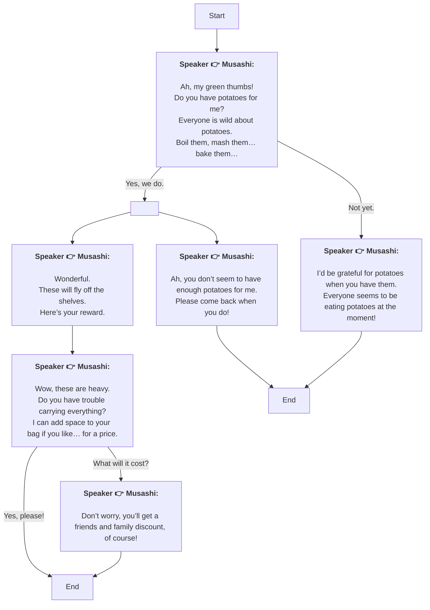

```mermaid
graph
Start -->1778095341823583[<b>Speaker 👉 Musashi:</b>
\nAh, my green thumbs!
Do you have potatoes for me?\nEveryone is wild about potatoes.
Boil them, mash them… bake them…]
1778095341823583 -->|Yes, we do.|1774177685387616[ ]
1778095341823583 -->|Not yet.|1774177735884129[<b>Speaker 👉 Musashi:</b>
\nI’d be grateful for potatoes when you have them.
Everyone seems to be eating potatoes at the moment!]
1774177685387616 -->1774177835329899[<b>Speaker 👉 Musashi:</b>
\nWonderful.
These will fly off the shelves.\nHere’s your reward.]
1774177685387616 -->1778095561299557[<b>Speaker 👉 Musashi:</b>
\nAh, you don’t seem to have enough potatoes for me.
Please come back when you do!]
1778095561299557 -->1774177801912677[End]
1774177835329899 -->1778095780704873[<b>Speaker 👉 Musashi:</b>
\nWow, these are heavy.
Do you have trouble carrying everything?
I can add space to your bag if you like… for a price.]
1778095780704873 -->|Yes, please!|1775003298405709[End]
1778095780704873 -->|What will it cost?|1778096281832050[<b>Speaker 👉 Musashi:</b>
\nDon’t worry, you’ll get a friends and family discount, of course!]
1778096281832050 -->1775003298405709[End]
1774177735884129 -->1774177801912677[End]

```