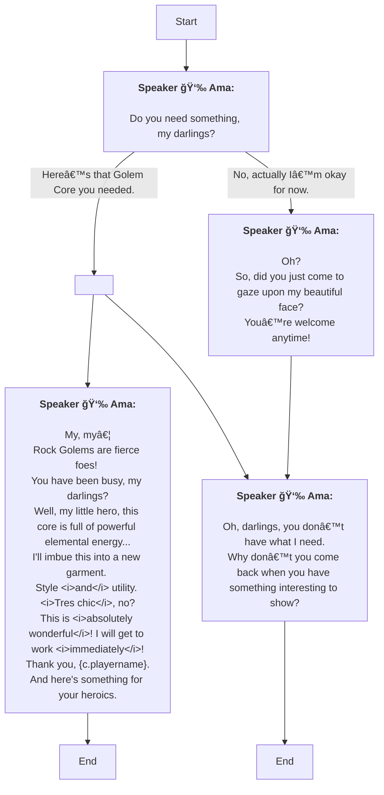

```mermaid
graph
Start -->1775618357714454[<b>Speaker 👉 Ama:</b>
\nDo you need something, my darlings?]
1775618357714454 -->|Here’s that Golem Core you needed.|1774182727227748[ ]
1775618357714454 -->|No, actually I’m okay for now.|1775618387821088[<b>Speaker 👉 Ama:</b>
\nOh?
So, did you just come to gaze upon my beautiful face?\nYou’re welcome anytime!]
1775618387821088 -->1775619528192557[<b>Speaker 👉 Ama:</b>
\nOh, darlings, you don’t have what I need.
Why don’t you come back when you have something interesting to show?]
1775619528192557 -->1774182870535537[End]
1774182727227748 -->1774182922150260[<b>Speaker 👉 Ama:</b>
\nMy, my…
Rock Golems are fierce foes! 
You have been busy, my darlings?\nWell, my little hero, this core is full of powerful elemental energy...
I'll imbue this into a new garment. 
Style &lt;i&gt;and&lt;/i&gt; utility. &lt;i&gt;Tres chic&lt;/i&gt;, no?\nThis is &lt;i&gt;absolutely wonderful&lt;/i&gt;! I will get to work &lt;i&gt;immediately&lt;/i&gt;!
Thank you, &lbrace;c.playername&rbrace;.
And here's something for your heroics.]
1774182727227748 -->1775619528192557[<b>Speaker 👉 Ama:</b>
\nOh, darlings, you don’t have what I need.
Why don’t you come back when you have something interesting to show?]
1774182922150260 -->1774182998082936[End]

```