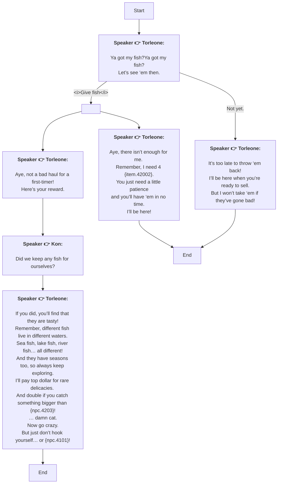

```mermaid
graph
Start -->1775069831435641[<b>Speaker 👉 Torleone:</b>
\nYa got my fish?Ya got my fish?
Let’s see ‘em then.]
1775069831435641 -->|&lt;i&gt;Give fish&lt;/i&gt;|1775069884284285[ ]
1775069831435641 -->|Not yet.|1775069950418312[<b>Speaker 👉 Torleone:</b>
\nIt’s too late to throw ‘em back!
I’ll be here when you’re ready to sell.
But I won’t take ‘em if they’ve gone bad!]
1775069884284285 -->1775069988052363[<b>Speaker 👉 Torleone:</b>
\nAye, not a bad haul for a first-timer!
Here’s your reward.]
1775069884284285 -->1778122378344034[<b>Speaker 👉 Torleone:</b>
\nAye, there isn’t enough for me. 
Remember, I need 4 &lbrace;item.42002&rbrace;.\nYou just need a little patience
and you’ll have ‘em in no time.\nI’ll be here!]
1775069988052363 -->1775522918356338[<b>Speaker 👉 Kon:</b>
\nDid we keep any fish for ourselves?]
1775522918356338 -->1775523012191605[<b>Speaker 👉 Torleone:</b>
\nIf you did, you’ll find that they are tasty!\nRemember, different fish live in different waters.
Sea fish, lake fish, river fish… all different!
And they have seasons too, so always keep exploring.\nI’ll pay top dollar for rare delicacies. 
And double if you catch something bigger than &lbrace;npc.4203&rbrace;!
… damn cat.\nNow go crazy.
But just don’t hook yourself… or &lbrace;npc.4101&rbrace;!]
1775523012191605 -->1775070090159504[End]
1778122378344034 -->1775069972410762[End]
1775069950418312 -->1775069972410762[End]

```