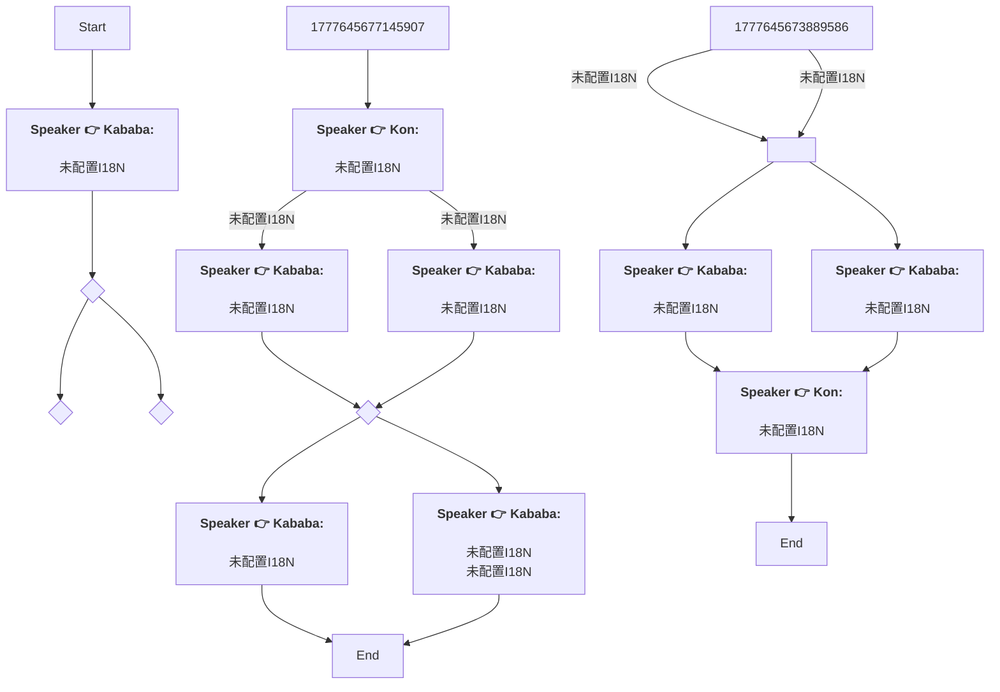

```mermaid
graph
Start -->1777645635331884[<b>Speaker 👉 Kababa:</b>
\n未配置I18N]
1777645635331884 -->1777647406066518{ }
1777647406066518 -->1777645652311853{ }
1777647406066518 -->1777647423759195{ }
1777645677145907 -->1777645985506111[<b>Speaker 👉 Kon:</b>
\n未配置I18N]
1777645985506111 -->|未配置I18N|1777646096860999[<b>Speaker 👉 Kababa:</b>
\n未配置I18N]
1777645985506111 -->|未配置I18N|1777646109645642[<b>Speaker 👉 Kababa:</b>
\n未配置I18N]
1777646096860999 -->1777646258836304{ }
1777646258836304 -->1777646387039057[<b>Speaker 👉 Kababa:</b>
\n未配置I18N\n未配置I18N]
1777646258836304 -->1777646115838797[<b>Speaker 👉 Kababa:</b>
\n未配置I18N]
1777646115838797 -->1777646407665492[End]
1777646387039057 -->1777646407665492[End]
1777646109645642 -->1777646258836304{ }
1777645673889586 -->|未配置I18N|1777647454681950[ ]
1777645673889586 -->|未配置I18N|1777647454681950[ ]
1777647454681950 -->1777645772156731[<b>Speaker 👉 Kababa:</b>
\n未配置I18N]
1777647454681950 -->1777647466701663[<b>Speaker 👉 Kababa:</b>
\n未配置I18N]
1777645772156731 -->1777647568092003[<b>Speaker 👉 Kon:</b>
\n未配置I18N]
1777647568092003 -->1777647516983138[End]
1777647466701663 -->1777647568092003[<b>Speaker 👉 Kon:</b>
\n未配置I18N]

```