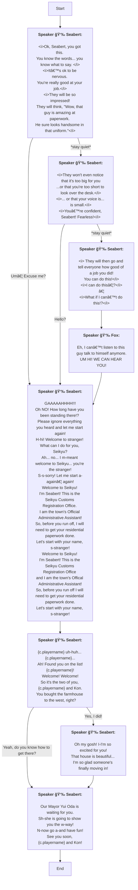

```mermaid
graph
Start -->1738447575181418[<b>Speaker 👉 Seabert:</b>
\n&lt;i&gt;Ok, Seabert, you got this. 
You know the words... you know what to say. &lt;/i&gt;\n&lt;i&gt;It’s ok to be nervous. 
You're really good at your job.&lt;/i&gt;\n&lt;i&gt;They will be so impressed!
They will think, &quot;Wow, that guy is amazing at paperwork. 
He sure looks handsome in that uniform.&quot;&lt;/i&gt;]
1738447575181418 -->|Um… Excuse me?|1768528440716181[<b>Speaker 👉 Seabert:</b>
\nGAAAAAHHHH!!!\nOh NO! How long have you been standing there!? 
Please ignore everything you heard and let me start again!\nH-hi! Welcome to stranger! What can I do for you, Seikyu?
Ah... no... I m-meant welcome to Seikyu... you're the stranger!
S-s-sorry! Let me start a-again… again!\nWelcome to Seikyu! 
I'm Seabert! This is the Seikyu Customs Registration Office. 
I am the town's Official Administrative Assistant!\nSo, before you run off, I will need to get your residential paperwork done.
Let's start with your name, s-stranger!\nWelcome to Seikyu! 
I'm Seabert! This is the Seikyu Customs Registration Office 
and I am the town's Offical Administrative Assistant!\nSo, before you run off I will need to get your residential paperwork done.
Let's start with your name, s-stranger!]
1738447575181418 -->|*stay quiet*|1768524084245382[<b>Speaker 👉 Seabert:</b>
\n&lt;i&gt;They won't even notice that it's too big for you
...or that you're too short to look over the desk.&lt;/i&gt;\n&lt;i&gt;... or that your voice is... is small.&lt;/i&gt;\n&lt;i&gt;You’re confident, Seabert! Fearless!&lt;/i&gt;]
1768524084245382 -->|Hello?|1768528440716181[<b>Speaker 👉 Seabert:</b>
\nGAAAAAHHHH!!!\nOh NO! How long have you been standing there!? 
Please ignore everything you heard and let me start again!\nH-hi! Welcome to stranger! What can I do for you, Seikyu?
Ah... no... I m-meant welcome to Seikyu... you're the stranger!
S-s-sorry! Let me start a-again… again!\nWelcome to Seikyu! 
I'm Seabert! This is the Seikyu Customs Registration Office. 
I am the town's Official Administrative Assistant!\nSo, before you run off, I will need to get your residential paperwork done.
Let's start with your name, s-stranger!\nWelcome to Seikyu! 
I'm Seabert! This is the Seikyu Customs Registration Office 
and I am the town's Offical Administrative Assistant!\nSo, before you run off I will need to get your residential paperwork done.
Let's start with your name, s-stranger!]
1768524084245382 -->|*stay quiet*|1768524129524615[<b>Speaker 👉 Seabert:</b>
\n&lt;i&gt; They will then go and tell everyone how good of a job you did!
You can do this!&lt;/i&gt;\n&lt;i&gt;I can do this…?&lt;/i&gt;
…\n&lt;i&gt;What if I can’t do this!?&lt;/i&gt;]
1768524129524615 -->1768524189845389[<b>Speaker 👉 Fox:</b>
\nEh, I can’t listen to this guy talk to himself anymore.\nUM HI! WE CAN HEAR YOU!]
1768524189845389 -->1768528440716181[<b>Speaker 👉 Seabert:</b>
\nGAAAAAHHHH!!!\nOh NO! How long have you been standing there!? 
Please ignore everything you heard and let me start again!\nH-hi! Welcome to stranger! What can I do for you, Seikyu?
Ah... no... I m-meant welcome to Seikyu... you're the stranger!
S-s-sorry! Let me start a-again… again!\nWelcome to Seikyu! 
I'm Seabert! This is the Seikyu Customs Registration Office. 
I am the town's Official Administrative Assistant!\nSo, before you run off, I will need to get your residential paperwork done.
Let's start with your name, s-stranger!\nWelcome to Seikyu! 
I'm Seabert! This is the Seikyu Customs Registration Office 
and I am the town's Offical Administrative Assistant!\nSo, before you run off I will need to get your residential paperwork done.
Let's start with your name, s-stranger!]
1768528440716181 -->1738448731861105[<b>Speaker 👉 Seabert:</b>
\n&lbrace;c.playername&rbrace; uh-huh... &lbrace;c.playername&rbrace;...
Ah! Found you on the list!
&lbrace;c.playername&rbrace;!\nWelcome! Welcome!
So it's the two of you, &lbrace;c.playername&rbrace; and Kon.\nYou bought the farmhouse to the west, right?]
1738448731861105 -->|Yeah, do you know how to get there?|1768529659287446[<b>Speaker 👉 Seabert:</b>
\nOur Mayor Yui Oda is waiting for you.
Sh-she is going to show you the w-way!\nN-now go a-and have fun!
See you soon, &lbrace;c.playername&rbrace; and Kon!]
1738448731861105 -->|Yes, I did!|1738453157967982[<b>Speaker 👉 Seabert:</b>
\nOh my gosh! I-I'm so excited for you!
That house is beautiful... I'm so glad someone's finally moving in!]
1738453157967982 -->1768529659287446[<b>Speaker 👉 Seabert:</b>
\nOur Mayor Yui Oda is waiting for you.
Sh-she is going to show you the w-way!\nN-now go a-and have fun!
See you soon, &lbrace;c.playername&rbrace; and Kon!]
1768529659287446 -->1738448411946096[End]

```