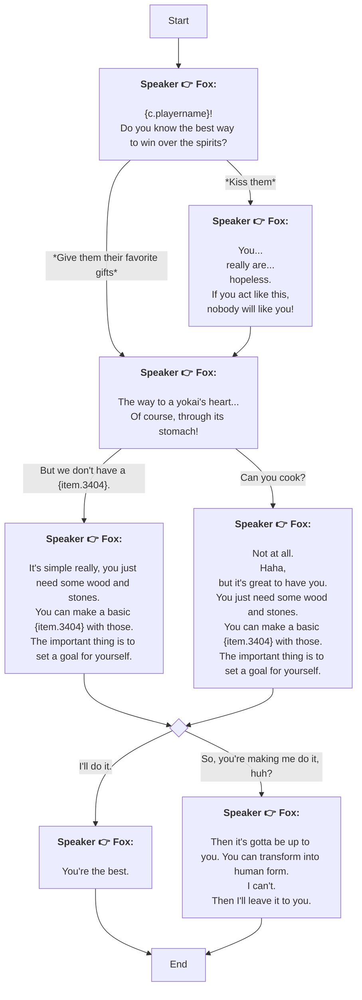

```mermaid
graph
Start -->1738530500713615[<b>Speaker 👉 Fox:</b>
\n&lbrace;c.playername&rbrace;!
Do you know the best way to win over the spirits?]
1738530500713615 -->|*Give them their favorite gifts*|1749512740558126[<b>Speaker 👉 Fox:</b>
\nThe way to a yokai's heart...
Of course, through its stomach!]
1738530500713615 -->|*Kiss them*|1749512535586093[<b>Speaker 👉 Fox:</b>
\nYou... 
really are... 
hopeless.\nIf you act like this,
nobody will like you!]
1749512535586093 -->1749512740558126[<b>Speaker 👉 Fox:</b>
\nThe way to a yokai's heart...
Of course, through its stomach!]
1749512740558126 -->|Can you cook?|1751472323004745[<b>Speaker 👉 Fox:</b>
\nNot at all.\nHaha,
but it's great to have you.\nYou just need some wood and stones.
You can make a basic &lbrace;item.3404&rbrace; with those.
The important thing is to set a goal for yourself.]
1749512740558126 -->|But we don't have a &lbrace;item.3404&rbrace;.|1751472270890311[<b>Speaker 👉 Fox:</b>
\nIt's simple really, you just need some wood and stones.
You can make a basic &lbrace;item.3404&rbrace; with those.
The important thing is to set a goal for yourself.]
1751472270890311 -->437868067722577{ }
1751472427525455 -->1738530669388945[End]
1751472450629968 -->1738530669388945[End]
1751472323004745 -->437868067722577{ }
437868067722577 -->|So, you're making me do it, huh?|1751472450629968[<b>Speaker 👉 Fox:</b>
\nThen it's gotta be up to you. You can transform into human form.
I can't.\nThen I'll leave it to you.]
437868067722577 -->|I'll do it.|1751472427525455[<b>Speaker 👉 Fox:</b>
\nYou're the best.]

```