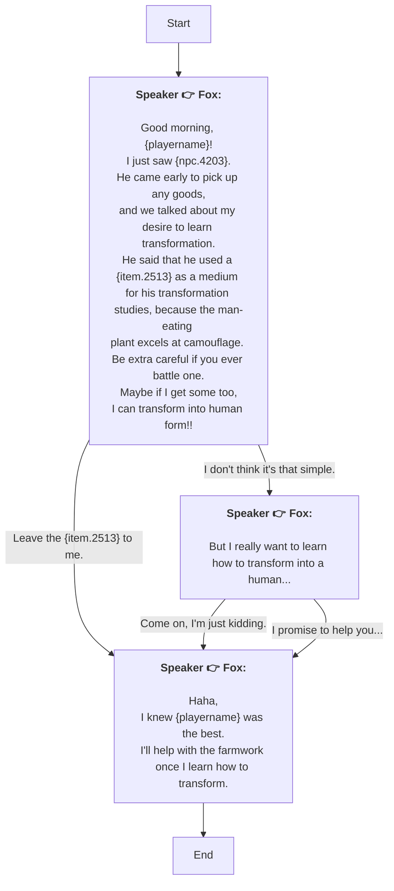

```mermaid
graph
Start -->1738538993755293[<b>Speaker 👉 Fox:</b>
\nGood morning, &lbrace;playername&rbrace;!\nI just saw &lbrace;npc.4203&rbrace;.
He came early to pick up any goods,
and we talked about my desire to learn transformation.\nHe said that he used a &lbrace;item.2513&rbrace; as a medium 
for his transformation studies, because the man-eating 
plant excels at camouflage. Be extra careful if you ever battle one.\nMaybe if I get some too,
I can transform into human form!!]
1738538993755293 -->|I don't think it's that simple.|1738539246921891[<b>Speaker 👉 Fox:</b>
\nBut I really want to learn how to transform into a human...]
1738538993755293 -->|Leave the &lbrace;item.2513&rbrace; to me.|1738539326217385[<b>Speaker 👉 Fox:</b>
\nHaha,
I knew &lbrace;playername&rbrace; was the best.
I'll help with the farmwork once I learn how to transform.]
1738539246921891 -->|Come on, I'm just kidding.|1738539326217385[<b>Speaker 👉 Fox:</b>
\nHaha,
I knew &lbrace;playername&rbrace; was the best.
I'll help with the farmwork once I learn how to transform.]
1738539246921891 -->|I promise to help you...|1738539326217385[<b>Speaker 👉 Fox:</b>
\nHaha,
I knew &lbrace;playername&rbrace; was the best.
I'll help with the farmwork once I learn how to transform.]
1738539326217385 -->1738539373948074[End]

```