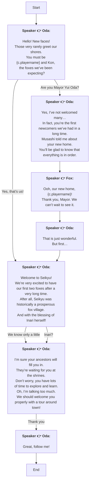

```mermaid
graph
Start -->1741755494745335[<b>Speaker 👉 Oda:</b>
\nHello! New faces!
Those very rarely greet our shores.\nYou must be &lbrace;c.playername&rbrace; and Kon, the foxes we’ve been expecting?]
1741755494745335 -->|Yes, that’s us!|1772249115197577[<b>Speaker 👉 Oda:</b>
\nWelcome to Seikyu!
We’re very excited to have our first two foxes after a very long time.\nAfter all, Seikyu was historically a prosperous fox village.
And with the blessing of Inari herself!]
1741755494745335 -->|Are you Mayor Yui Oda?|1772249154253962[<b>Speaker 👉 Oda:</b>
\nYes, I’ve not welcomed many…
In fact, you’re the first newcomers we’ve had in a long time.\nMusashi told me about your new home.
You’ll be glad to know that everything is in order.]
1772249115197577 -->|We know only a little|1772249178320011[<b>Speaker 👉 Oda:</b>
\nI’m sure your ancestors will fill you in.
They’re waiting for you at the shrines.
Don’t worry, you have lots of time to explore and learn.\nOh, I’m talking too much.
We should welcome you properly with a tour around town!]
1772249115197577 -->|Inari?|1772249178320011[<b>Speaker 👉 Oda:</b>
\nI’m sure your ancestors will fill you in.
They’re waiting for you at the shrines.
Don’t worry, you have lots of time to explore and learn.\nOh, I’m talking too much.
We should welcome you properly with a tour around town!]
1772249178320011 -->|Thank you|1775357171940721[<b>Speaker 👉 Oda:</b>
\nGreat, follow me!]
1775357171940721 -->1741757282187580[End]
1772249154253962 -->1775356721476954[<b>Speaker 👉 Fox:</b>
\nOoh, our new home, &lbrace;c.playername&rbrace;!
Thank you, Mayor. We can’t wait to see it.]
1775356721476954 -->1775356983500126[<b>Speaker 👉 Oda:</b>
\nThat is just wonderful. 
But first…]
1775356983500126 -->1772249115197577[<b>Speaker 👉 Oda:</b>
\nWelcome to Seikyu!
We’re very excited to have our first two foxes after a very long time.\nAfter all, Seikyu was historically a prosperous fox village.
And with the blessing of Inari herself!]

```