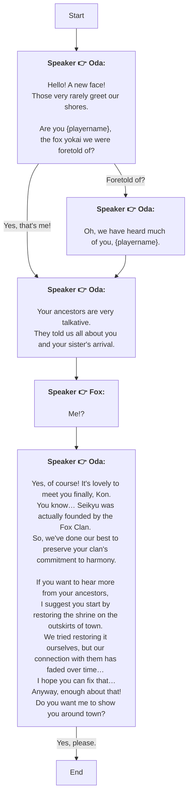

```mermaid
graph
Start -->1741755494745335[<b>Speaker 👉 Oda:</b>
\nHello! A new face!
Those very rarely greet our shores.
\nAre you &lbrace;playername&rbrace;, 
the fox yokai we were foretold of?]
1741755494745335 -->|Yes, that's me!|1772249115197577[<b>Speaker 👉 Oda:</b>
\nYour ancestors are very talkative.
They told us all about you and your sister's arrival.
]
1741755494745335 -->|Foretold of?|1772249154253962[<b>Speaker 👉 Oda:</b>
\nOh, we have heard much of you, &lbrace;playername&rbrace;.]
1772249115197577 -->1741757163471162[<b>Speaker 👉 Fox:</b>
\nMe!?]
1741757163471162 -->1772249178320011[<b>Speaker 👉 Oda:</b>
\nYes, of course! It's lovely to meet you finally, Kon.\nYou know… Seikyu was actually founded by the Fox Clan. 
So, we've done our best to preserve your clan's commitment to harmony.
\nIf you want to hear more from your ancestors, 
I suggest you start by restoring the shrine on the outskirts of town. \nWe tried restoring it ourselves, but our connection with them has faded over time… 
I hope you can fix that…\nAnyway, enough about that!
Do you want me to show you around town?
]
1772249178320011 -->|Yes, please.|1741757282187580[End]
1772249154253962 -->1772249115197577[<b>Speaker 👉 Oda:</b>
\nYour ancestors are very talkative.
They told us all about you and your sister's arrival.
]

```