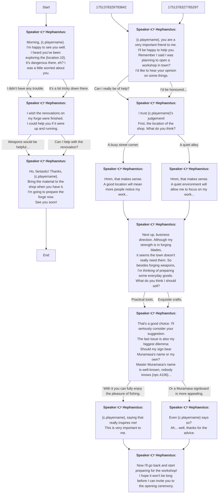

```mermaid
graph
Start -->1751377615148325[<b>Speaker 👉 Hephaestus:</b>
\nMorning, &lbrace;c.playername&rbrace;. 
I'm happy to see you well.\nI heard you've been exploring the &lbrace;location.10&rbrace;. 
It's dangerous there, eh? I was a little worried about you.]
1751377615148325 -->|I didn't have any trouble.|1751378039158059[<b>Speaker 👉 Hephaestus:</b>
\nI wish the renovations on my forge were finished. 
I could help you if it were up and running.]
1751377615148325 -->|It's a bit tricky down there.|1751378039158059[<b>Speaker 👉 Hephaestus:</b>
\nI wish the renovations on my forge were finished. 
I could help you if it were up and running.]
1751378039158059 -->|Weapons would be helpful…|1771882614715479[<b>Speaker 👉 Hephaestus:</b>
\nHo, fantastic! Thanks, &lbrace;c.playername&rbrace;.
Bring the material to the shop when you have it.\nI'm going to prepare the forge now.
See you soon!]
1751378039158059 -->| Can I help with the renovation?|1771882614715479[<b>Speaker 👉 Hephaestus:</b>
\nHo, fantastic! Thanks, &lbrace;c.playername&rbrace;.
Bring the material to the shop when you have it.\nI'm going to prepare the forge now.
See you soon!]
1771882614715479 -->1751444812541539[End]
1751378329793842 -->1751442595199554[<b>Speaker 👉 Hephaestus:</b>
\n&lbrace;c.playername&rbrace;, you are a very important friend to me. I'll be happy to help you.\nRemember I said I was planning to open a workshop in town?
I'd like to hear your opinion on some things.]
1751442595199554 -->|Can I really be of help?|1751442854535753[<b>Speaker 👉 Hephaestus:</b>
\nI trust &lbrace;c.playername&rbrace;'s judgement!\nFirst, the location of the shop. What do you think?]
1751442595199554 -->|I'd be honoured...|1751442854535753[<b>Speaker 👉 Hephaestus:</b>
\nI trust &lbrace;c.playername&rbrace;'s judgement!\nFirst, the location of the shop. What do you think?]
1751442854535753 -->|A quiet alley.|1751443333373520[<b>Speaker 👉 Hephaestus:</b>
\nHmm, that makes sense.
A quiet environment will allow me to focus on my work...]
1751442854535753 -->|A busy street corner.|1751443330296399[<b>Speaker 👉 Hephaestus:</b>
\nHmm, that makes sense.
A good location will mean more people notice my work...]
1751443330296399 -->1751443519333969[<b>Speaker 👉 Hephaestus:</b>
\nNext up, business direction. Although my strength is in forging blades,
it seems the town doesn't really need them. So besides forging weapons, 
I'm thinking of preparing some everyday goods. What do you think I should sell?]
1751443519333969 -->|Practical tools.|1751444020978263[<b>Speaker 👉 Hephaestus:</b>
\nThat's a good choice. I'll seriously consider your suggestion.\nThe last issue is also my biggest dilemma:
Should my sign bear Muramasa's name or my own? 
Master Muramasa's name is well-known, nobody knows &lbrace;npc.4106&rbrace;...]
1751443519333969 -->|Exquisite crafts.|1751444020978263[<b>Speaker 👉 Hephaestus:</b>
\nThat's a good choice. I'll seriously consider your suggestion.\nThe last issue is also my biggest dilemma:
Should my sign bear Muramasa's name or my own? 
Master Muramasa's name is well-known, nobody knows &lbrace;npc.4106&rbrace;...]
1751444020978263 -->|Or a Muramasa signboard is more appealing.|1751444372518497[<b>Speaker 👉 Hephaestus:</b>
\nEven &lbrace;c.playername&rbrace; says so? 
Ah... well, thanks for the advice.]
1751444020978263 -->|With it you can fully enjoy the pleasure of fishing.|1751444367376992[<b>Speaker 👉 Hephaestus:</b>
\n&lbrace;c.playername&rbrace;, saying that really inspires me!
This is very important to me.]
1751444367376992 -->1751444603660898[<b>Speaker 👉 Hephaestus:</b>
\nNow I'll go back and start preparing for the workshop!
I hope it won't be long before I can invite you to the opening ceremony.]
1751444372518497 -->1751444603660898[<b>Speaker 👉 Hephaestus:</b>
\nNow I'll go back and start preparing for the workshop!
I hope it won't be long before I can invite you to the opening ceremony.]
1751443333373520 -->1751443519333969[<b>Speaker 👉 Hephaestus:</b>
\nNext up, business direction. Although my strength is in forging blades,
it seems the town doesn't really need them. So besides forging weapons, 
I'm thinking of preparing some everyday goods. What do you think I should sell?]
1751378327765297 -->1751442595199554[<b>Speaker 👉 Hephaestus:</b>
\n&lbrace;c.playername&rbrace;, you are a very important friend to me. I'll be happy to help you.\nRemember I said I was planning to open a workshop in town?
I'd like to hear your opinion on some things.]

```