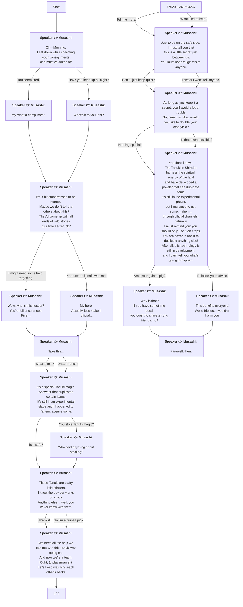

```mermaid
graph
Start -->1772943296666922[<b>Speaker 👉 Musashi:</b>
\nOh—Morning. 
I sat down while collecting your consignments,
and must've dozed off.]
1772943296666922 -->|Have you been up all night?|1772943372591409[<b>Speaker 👉 Musashi:</b>
\nWhat's it to you, hm?]
1772943296666922 -->|You seem tired.|1772943350889776[<b>Speaker 👉 Musashi:</b>
\nMy, what a compliment.]
1772943350889776 -->1772943403083058[<b>Speaker 👉 Musashi:</b>
\nI'm a bit embarrassed to be honest. 
Maybe we don't tell the others about this?
They'd come up with all kinds of wild stories.\nOur little secret, ok?]
1772943403083058 -->|Your secret is safe with me.|1772943524543802[<b>Speaker 👉 Musashi:</b>
\nMy hero. 
Actually, let's make it official…]
1772943403083058 -->|I might need some help forgetting.|1772943505891641[<b>Speaker 👉 Musashi:</b>
\nWow, who is this hustler? 
You're full of surprises. 
Fine…]
1772943505891641 -->1772943552381243[<b>Speaker 👉 Musashi:</b>
\nTake this…]
1772943552381243 -->|What is this?|1772943781244225[<b>Speaker 👉 Musashi:</b>
\nIt's a special Tanuki magic. 
Apowder that duplicates certain items. 
It's still in an experimental stage and I happened to *ahem, acquire some.]
1772943552381243 -->|Uh… Thanks?|1772943781244225[<b>Speaker 👉 Musashi:</b>
\nIt's a special Tanuki magic. 
Apowder that duplicates certain items. 
It's still in an experimental stage and I happened to *ahem, acquire some.]
1772943781244225 -->|Is it safe?|1772944193105224[<b>Speaker 👉 Musashi:</b>
\nThose Tanuki are crafty little stinkers.
I know the powder works on crops.
Anything else… well, you never know with them.]
1772943781244225 -->|You stole Tanuki magic?|1772944175696199[<b>Speaker 👉 Musashi:</b>
\nWho said anything about stealing?]
1772944175696199 -->1772944193105224[<b>Speaker 👉 Musashi:</b>
\nThose Tanuki are crafty little stinkers.
I know the powder works on crops.
Anything else… well, you never know with them.]
1772944193105224 -->|Thanks!|1772944237097294[<b>Speaker 👉 Musashi:</b>
\nWe need all the help we can get with this Tanuki war going on. 
And now we're a team. Right, &lbrace;c.playername&rbrace;? 
Let's keep watching each other's backs.]
1772944193105224 -->|So I'm a guinea pig?|1772944237097294[<b>Speaker 👉 Musashi:</b>
\nWe need all the help we can get with this Tanuki war going on. 
And now we're a team. Right, &lbrace;c.playername&rbrace;? 
Let's keep watching each other's backs.]
1772944237097294 -->1752150325082526[End]
1772943524543802 -->1772943552381243[<b>Speaker 👉 Musashi:</b>
\nTake this…]
1772943372591409 -->1772943403083058[<b>Speaker 👉 Musashi:</b>
\nI'm a bit embarrassed to be honest. 
Maybe we don't tell the others about this?
They'd come up with all kinds of wild stories.\nOur little secret, ok?]
1752082361594237 -->|Tell me more.|1752083440273795[<b>Speaker 👉 Musashi:</b>
\nJust to be on the safe side, I must tell you that
this is a little secret just between us.
You must not divulge this to anyone.]
1752082361594237 -->|What kind of help?|1752083440273795[<b>Speaker 👉 Musashi:</b>
\nJust to be on the safe side, I must tell you that
this is a little secret just between us.
You must not divulge this to anyone.]
1752083440273795 -->|Can't I just keep quiet?|1752084589987209[<b>Speaker 👉 Musashi:</b>
\nAs long as you keep it a secret, you'll avoid a lot of trouble.\nSo, here it is: How would you like to double your crop yield?]
1752083440273795 -->|I swear I won't tell anyone.|1752084589987209[<b>Speaker 👉 Musashi:</b>
\nAs long as you keep it a secret, you'll avoid a lot of trouble.\nSo, here it is: How would you like to double your crop yield?]
1752084589987209 -->|Nothing special.|1752146947163539[<b>Speaker 👉 Musashi:</b>
\nYou don't know...
The Tanuki in Shikoku harness the spiritual energy of the land
and have developed a powder that can duplicate items.\nIt's still in the experimental phase,
but I managed to get some... ahem...
through official channels, naturally.\nI must remind you: you should only use it on crops.
You are never to use it to duplicate anything else!\nAfter all, this technology is still in development,
and I can't tell you what's going to happen.]
1752084589987209 -->|Is that even possible?|1752146947163539[<b>Speaker 👉 Musashi:</b>
\nYou don't know...
The Tanuki in Shikoku harness the spiritual energy of the land
and have developed a powder that can duplicate items.\nIt's still in the experimental phase,
but I managed to get some... ahem...
through official channels, naturally.\nI must remind you: you should only use it on crops.
You are never to use it to duplicate anything else!\nAfter all, this technology is still in development,
and I can't tell you what's going to happen.]
1752146947163539 -->|I'll follow your advice.|1752149989083548[<b>Speaker 👉 Musashi:</b>
\nThis benefits everyone!
We're friends, I wouldn't harm you.]
1752146947163539 -->|Am I your guinea pig?|1752149986771355[<b>Speaker 👉 Musashi:</b>
\nWhy is that?
If you have something good,
you ought to share among friends, no?]
1752149986771355 -->1752150248375709[<b>Speaker 👉 Musashi:</b>
\nFarewell, then.]
1752149989083548 -->1752150248375709[<b>Speaker 👉 Musashi:</b>
\nFarewell, then.]

```