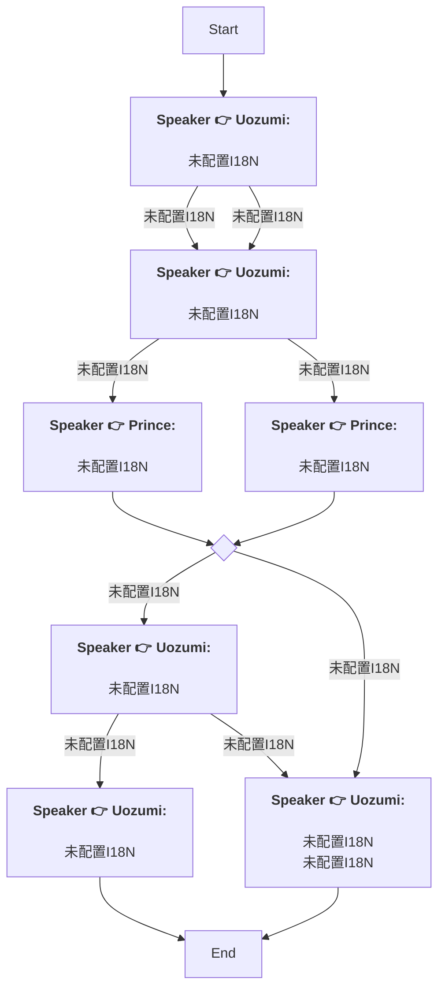

```mermaid
graph
Start -->1756252963994844[<b>Speaker 👉 Uozumi:</b>
\n未配置I18N]
1756252963994844 -->|未配置I18N|1756253006232805[<b>Speaker 👉 Uozumi:</b>
\n未配置I18N]
1756252963994844 -->|未配置I18N|1756253006232805[<b>Speaker 👉 Uozumi:</b>
\n未配置I18N]
1756253006232805 -->|未配置I18N|1756253083186413[<b>Speaker 👉 Prince:</b>
\n未配置I18N]
1756253006232805 -->|未配置I18N|1756253051721963[<b>Speaker 👉 Prince:</b>
\n未配置I18N]
1756253051721963 -->439063262930490{ }
1756253146034419 -->1756253275416827[End]
1756253182380276 -->|未配置I18N|1756253236786426[<b>Speaker 👉 Uozumi:</b>
\n未配置I18N]
1756253182380276 -->|未配置I18N|1756253146034419[<b>Speaker 👉 Uozumi:</b>
\n未配置I18N\n未配置I18N]
1756253236786426 -->1756253275416827[End]
1756253083186413 -->439063262930490{ }
439063262930490 -->|未配置I18N|1756253182380276[<b>Speaker 👉 Uozumi:</b>
\n未配置I18N]
439063262930490 -->|未配置I18N|1756253146034419[<b>Speaker 👉 Uozumi:</b>
\n未配置I18N\n未配置I18N]

```