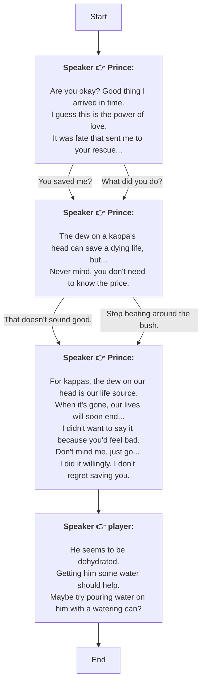

```mermaid
graph
Start -->1758079600629293[<b>Speaker 👉 Prince:</b>
\nAre you okay? Good thing I arrived in time.
I guess this is the power of love.
It was fate that sent me to your rescue...]
1758079600629293 -->|You saved me?|1758079630013998[<b>Speaker 👉 Prince:</b>
\nThe dew on a kappa's head can save a dying life, but...
Never mind, you don't need to know the price.]
1758079600629293 -->|What did you do?|1758079630013998[<b>Speaker 👉 Prince:</b>
\nThe dew on a kappa's head can save a dying life, but...
Never mind, you don't need to know the price.]
1758079630013998 -->|That doesn't sound good.|1758080090447418[<b>Speaker 👉 Prince:</b>
\nFor kappas, the dew on our head is our life source.
When it's gone, our lives will soon end...\nI didn't want to say it because you'd feel bad.
Don't mind me, just go... 
I did it willingly. I don't regret saving you.]
1758079630013998 -->|Stop beating around the bush.|1758080090447418[<b>Speaker 👉 Prince:</b>
\nFor kappas, the dew on our head is our life source.
When it's gone, our lives will soon end...\nI didn't want to say it because you'd feel bad.
Don't mind me, just go... 
I did it willingly. I don't regret saving you.]
1758080090447418 -->1758080284909115[<b>Speaker 👉 player:</b>
\nHe seems to be dehydrated.
Getting him some water should help.
Maybe try pouring water on him with a watering can?]
1758080284909115 -->1758080325624380[End]

```