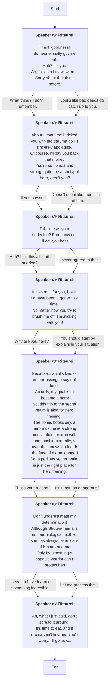

```mermaid
graph
Start -->1758349408510534[<b>Speaker 👉 Ritsurei:</b>
\nThank goodness! Someone finally got me out...\nHuh? It's you.\nAh, this is a bit awkward... Sorry about that thing before.]
1758349408510534 -->|What thing? I don't remember.|1758351422177868[<b>Speaker 👉 Ritsurei:</b>
\nAbout... that time I tricked you with the daruma doll, I sincerely apologize. 
Of course, I'll pay you back that money!\nYou're so honest and strong, quite the archetypal hero, aren't you?]
1758349408510534 -->|Looks like bad deeds do catch up to you.|1758351422177868[<b>Speaker 👉 Ritsurei:</b>
\nAbout... that time I tricked you with the daruma doll, I sincerely apologize. 
Of course, I'll pay you back that money!\nYou're so honest and strong, quite the archetypal hero, aren't you?]
1758351422177868 -->|If you say so...|1758352166443602[<b>Speaker 👉 Ritsurei:</b>
\nTake me as your underling? From now on, I'll call you boss!]
1758351422177868 -->|Doesn't seem like there's a problem.|1758352166443602[<b>Speaker 👉 Ritsurei:</b>
\nTake me as your underling? From now on, I'll call you boss!]
1758352166443602 -->|Huh? Isn't this all a bit sudden?|1758352479594073[<b>Speaker 👉 Ritsurei:</b>
\nIf it weren't for you, boss, I'd have been a goner this time. 
No matter how you try to brush me off, I'm sticking with you!]
1758352166443602 -->|I never agreed to that...|1758352479594073[<b>Speaker 👉 Ritsurei:</b>
\nIf it weren't for you, boss, I'd have been a goner this time. 
No matter how you try to brush me off, I'm sticking with you!]
1758352479594073 -->|Why are you here?|1758352687134303[<b>Speaker 👉 Ritsurei:</b>
\nBecause... ah, it's kind of embarrassing to say out loud. 
Actually, my goal is to become a hero!\nSo, this trip to the secret realm is also for hero training. 
The comic books say, a hero must have a strong constitution, an iron will, 
and most importantly, a heart that knows no fear in the face of mortal danger!\nSo, a perilous secret realm is just the right place for hero training.]
1758352479594073 -->|You should start by explaining your situation.|1758352687134303[<b>Speaker 👉 Ritsurei:</b>
\nBecause... ah, it's kind of embarrassing to say out loud. 
Actually, my goal is to become a hero!\nSo, this trip to the secret realm is also for hero training. 
The comic books say, a hero must have a strong constitution, an iron will, 
and most importantly, a heart that knows no fear in the face of mortal danger!\nSo, a perilous secret realm is just the right place for hero training.]
1758352687134303 -->|That's your reason?|1758354845234789[<b>Speaker 👉 Ritsurei:</b>
\nDon't underestimate my determination! 
Although Shuten-mama is not our biological mother, 
she has always taken care of Kintaro and me.\nOnly by becoming a capable warrior can I protect her!]
1758352687134303 -->|Isn't that too dangerous?|1758354845234789[<b>Speaker 👉 Ritsurei:</b>
\nDon't underestimate my determination! 
Although Shuten-mama is not our biological mother, 
she has always taken care of Kintaro and me.\nOnly by becoming a capable warrior can I protect her!]
1758354845234789 -->|I seem to have learned something incredible.|1758355546907243[<b>Speaker 👉 Ritsurei:</b>
\nAh, what I just said, don't spread it around. 
It's time to eat, and if mama can't find me, she'll worry. I'll go now...]
1758354845234789 -->|Let me process this...|1758355546907243[<b>Speaker 👉 Ritsurei:</b>
\nAh, what I just said, don't spread it around. 
It's time to eat, and if mama can't find me, she'll worry. I'll go now...]
1758355546907243 -->1758355777149548[End]

```