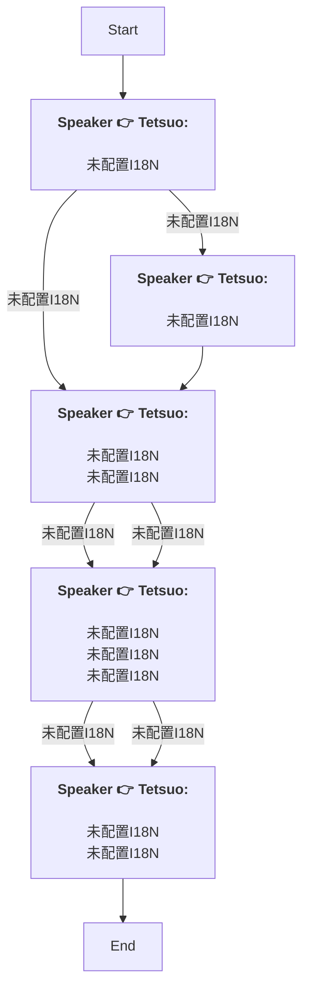

```mermaid
graph
Start -->1761373919956595[<b>Speaker 👉 Tetsuo:</b>
\n未配置I18N]
1761373919956595 -->|未配置I18N|1761437403457146[<b>Speaker 👉 Tetsuo:</b>
\n未配置I18N\n未配置I18N]
1761373919956595 -->|未配置I18N|1761437199394425[<b>Speaker 👉 Tetsuo:</b>
\n未配置I18N]
1761437199394425 -->1761437403457146[<b>Speaker 👉 Tetsuo:</b>
\n未配置I18N\n未配置I18N]
1761437403457146 -->|未配置I18N|1761441597741696[<b>Speaker 👉 Tetsuo:</b>
\n未配置I18N\n未配置I18N\n未配置I18N]
1761437403457146 -->|未配置I18N|1761441597741696[<b>Speaker 👉 Tetsuo:</b>
\n未配置I18N\n未配置I18N\n未配置I18N]
1761441597741696 -->|未配置I18N|1761442012375686[<b>Speaker 👉 Tetsuo:</b>
\n未配置I18N\n未配置I18N]
1761441597741696 -->|未配置I18N|1761442012375686[<b>Speaker 👉 Tetsuo:</b>
\n未配置I18N\n未配置I18N]
1761442012375686 -->1761442648085127[End]

```