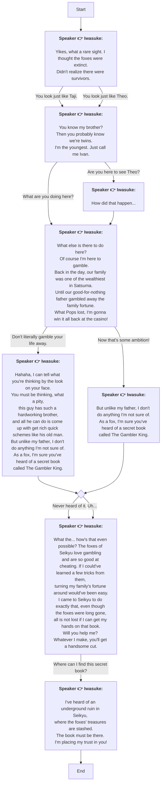

```mermaid
graph
Start -->1761701241683240[<b>Speaker 👉 Iwasuke:</b>
\nYikes, what a rare sight. I thought the foxes were extinct.
Didn't realize there were survivors.]
1761701241683240 -->|You look just like Taji.|1761704555641134[<b>Speaker 👉 Iwasuke:</b>
\nYou know my brother?
Then you probably know we're twins.
I'm the youngest. Just call me Ivan.]
1761701241683240 -->|You look just like Theo.|1761704555641134[<b>Speaker 👉 Iwasuke:</b>
\nYou know my brother?
Then you probably know we're twins.
I'm the youngest. Just call me Ivan.]
1761704555641134 -->|Are you here to see Theo?|1761704661288245[<b>Speaker 👉 Iwasuke:</b>
\nHow did that happen...]
1761704555641134 -->|What are you doing here?|1761704649089332[<b>Speaker 👉 Iwasuke:</b>
\nWhat else is there to do here?
Of course I'm here to gamble.\nBack in the day, our family was one of the wealthiest in Satsuma.
Until our good-for-nothing father gambled away the family fortune.\nWhat Pops lost, I'm gonna win it all back at the casino!]
1761704649089332 -->|Don't literally gamble your life away.|1761705096379707[<b>Speaker 👉 Iwasuke:</b>
\nHahaha, I can tell what you're thinking by the look on your face.\nYou must be thinking, what a pity,
this guy has such a hardworking brother,
and all he can do is come up with get rich quick schemes like his old man.\nBut unlike my father, I don't do anything I'm not sure of.\nAs a fox, I'm sure you've heard of a secret book
called The Gambler King.]
1761704649089332 -->|Now that's some ambition!|1761710933418319[<b>Speaker 👉 Iwasuke:</b>
\nBut unlike my father, I don't do anything I'm not sure of.\nAs a fox, I'm sure you've heard of a secret book
called The Gambler King.]
1761705096379707 -->440426274094926{ }
1761705710196033 -->|Where can I find this secret book?|1761707005660485[<b>Speaker 👉 Iwasuke:</b>
\nI've heard of an underground ruin in Seikyu, 
where the foxes' treasures are stashed.
The book must be there. I'm placing my trust in you!]
1761707005660485 -->1761707112633670[End]
440426274094926 -->|Never heard of it.|1761705710196033[<b>Speaker 👉 Iwasuke:</b>
\nWhat the... how's that even possible? The foxes of Seikyu love gambling 
and are so good at cheating. If I could've learned a few tricks from them, 
turning my family's fortune around would've been easy.\nI came to Seikyu to do exactly that, even though the foxes were long gone,
all is not lost if I can get my hands on that book.\nWill you help me? Whatever I make, you'll get a handsome cut.]
440426274094926 -->|Uh...|1761705710196033[<b>Speaker 👉 Iwasuke:</b>
\nWhat the... how's that even possible? The foxes of Seikyu love gambling 
and are so good at cheating. If I could've learned a few tricks from them, 
turning my family's fortune around would've been easy.\nI came to Seikyu to do exactly that, even though the foxes were long gone,
all is not lost if I can get my hands on that book.\nWill you help me? Whatever I make, you'll get a handsome cut.]
1761710933418319 -->440426274094926{ }
1761704661288245 -->1761704649089332[<b>Speaker 👉 Iwasuke:</b>
\nWhat else is there to do here?
Of course I'm here to gamble.\nBack in the day, our family was one of the wealthiest in Satsuma.
Until our good-for-nothing father gambled away the family fortune.\nWhat Pops lost, I'm gonna win it all back at the casino!]

```