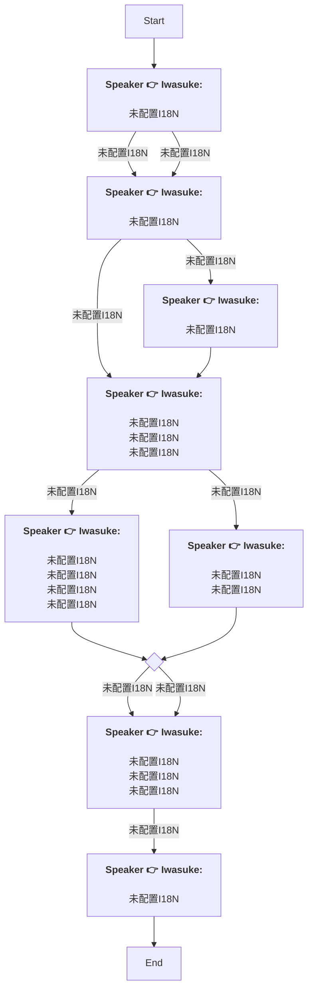

```mermaid
graph
Start -->1761701241683240[<b>Speaker 👉 Iwasuke:</b>
\n未配置I18N]
1761701241683240 -->|未配置I18N|1761704555641134[<b>Speaker 👉 Iwasuke:</b>
\n未配置I18N]
1761701241683240 -->|未配置I18N|1761704555641134[<b>Speaker 👉 Iwasuke:</b>
\n未配置I18N]
1761704555641134 -->|未配置I18N|1761704661288245[<b>Speaker 👉 Iwasuke:</b>
\n未配置I18N]
1761704555641134 -->|未配置I18N|1761704649089332[<b>Speaker 👉 Iwasuke:</b>
\n未配置I18N\n未配置I18N\n未配置I18N]
1761704649089332 -->|未配置I18N|1761705096379707[<b>Speaker 👉 Iwasuke:</b>
\n未配置I18N\n未配置I18N\n未配置I18N\n未配置I18N]
1761704649089332 -->|未配置I18N|1761710933418319[<b>Speaker 👉 Iwasuke:</b>
\n未配置I18N\n未配置I18N]
1761705096379707 -->440426274094926{ }
1761705710196033 -->|未配置I18N|1761707005660485[<b>Speaker 👉 Iwasuke:</b>
\n未配置I18N]
1761707005660485 -->1761707112633670[End]
440426274094926 -->|未配置I18N|1761705710196033[<b>Speaker 👉 Iwasuke:</b>
\n未配置I18N\n未配置I18N\n未配置I18N]
440426274094926 -->|未配置I18N|1761705710196033[<b>Speaker 👉 Iwasuke:</b>
\n未配置I18N\n未配置I18N\n未配置I18N]
1761710933418319 -->440426274094926{ }
1761704661288245 -->1761704649089332[<b>Speaker 👉 Iwasuke:</b>
\n未配置I18N\n未配置I18N\n未配置I18N]

```