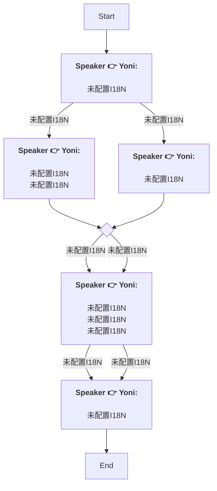

```mermaid
graph
Start -->1762964737821388[<b>Speaker 👉 Yoni:</b>
\n未配置I18N]
1762964737821388 -->|未配置I18N|1762964880279252[<b>Speaker 👉 Yoni:</b>
\n未配置I18N]
1762964737821388 -->|未配置I18N|1762965129398997[<b>Speaker 👉 Yoni:</b>
\n未配置I18N\n未配置I18N]
440741282349749 -->|未配置I18N|1762965159805654[<b>Speaker 👉 Yoni:</b>
\n未配置I18N\n未配置I18N\n未配置I18N]
440741282349749 -->|未配置I18N|1762965159805654[<b>Speaker 👉 Yoni:</b>
\n未配置I18N\n未配置I18N\n未配置I18N]
1762965129398997 -->440741282349749{ }
1762965159805654 -->|未配置I18N|1762965391964898[<b>Speaker 👉 Yoni:</b>
\n未配置I18N]
1762965159805654 -->|未配置I18N|1762965391964898[<b>Speaker 👉 Yoni:</b>
\n未配置I18N]
1762965391964898 -->1762965405605603[End]
1762964880279252 -->440741282349749{ }

```